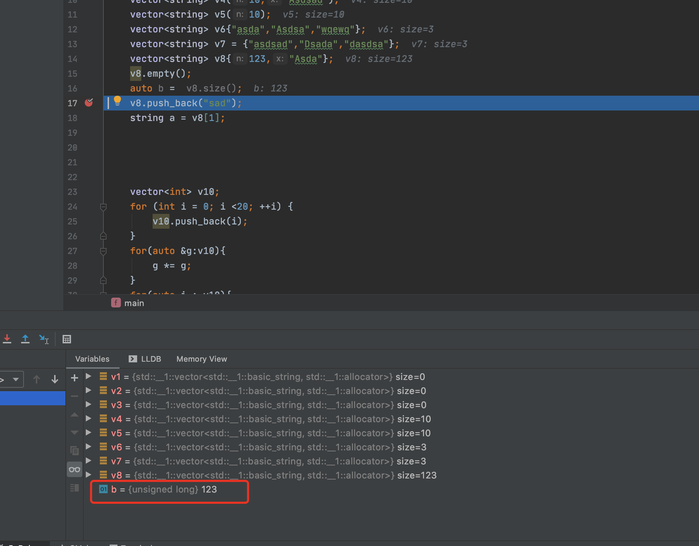
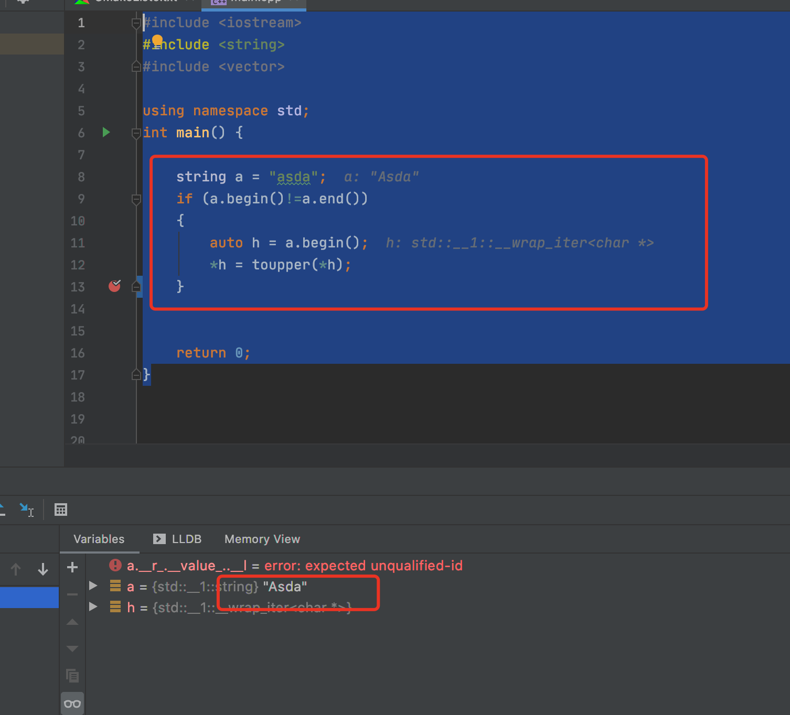
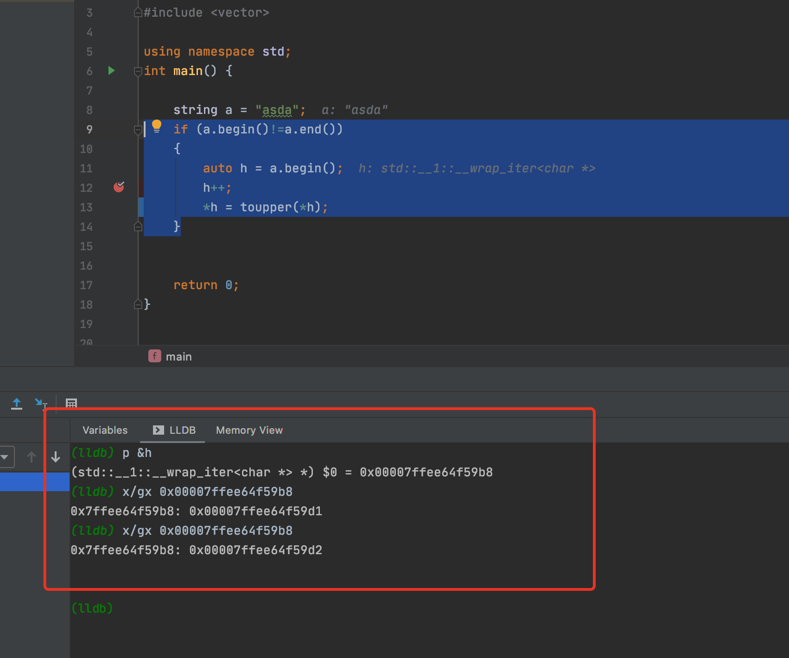
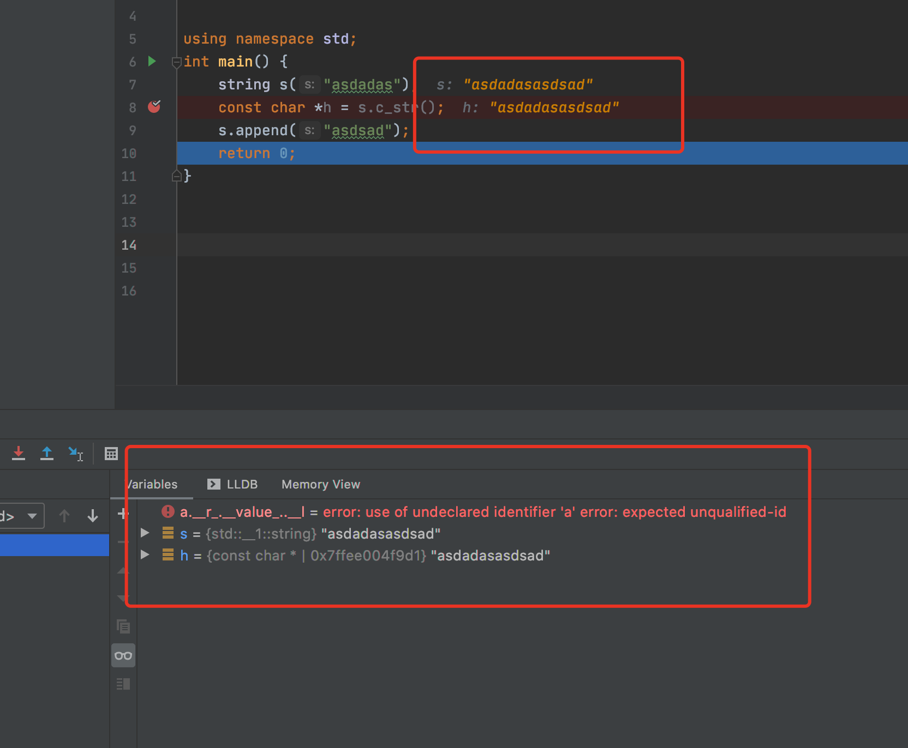

# C++Primer-第三章

## 命名空间using声明

比如`std::cin`这其实表示的是：编译器应从操作符的左侧名字所示的作用域中寻找右侧那个名字。

值得注意的是，头文件不应该使用`using`声明，因为头文件的内容会拷贝到所有引用它的文件中去，这很可能导致冲突（比如命名冲突）。

## 标准库类型string

> 比较平常的不做记录

初始化方式：

~~~c++
string s1; //默认初始化，其为NULL
string s1 = s2;
string s1 = "abcd";
string s1(10,"c");
~~~

string::size_type类型：

~~~c++
string a = "asdad";
int b = a.size();
~~~

你以为`size()`函数返回的是`int`类型？其实不是，`size`函数返回的是一个`string::size_type`类型。

* 它一个无符号类型，足够放下任何`string`对象的大小，那么所有用于存放`size()`函数返回值的变量都应该是`string::size_type`类型的。

  * ~~~c++
    auto len = a.size(); //这样就可以啦，我们调试发现len的类型为unsigned int 但是其类型为`string::size_type`（书上这么说的，但是肯定是一个无符号类型整数啦）
    ~~~

string对象特性：

* `string`对象会自动忽略空白。

  * ~~~ c++
    string s;
    cin>>s;
    //输入 "     abcd"
    //s == "abcd"
    ~~~

* `string`的比较规则：

  * 判断两个`string`的长度是否相同。
  * 判断两个`string`的包含字符是否相等。

  > 这其实避免了C语言中`\x00`所带来的可能错误。

* `string`的相加规则

  * C++允许`string`和字面值相加。

    * ~~~c++
      string a = "asdsa";
      string b = a + "asda";
      ~~~

  * C++相加的时候必须保证`+`的两侧至少有一个`string`.

    * ~~~c++
      string a = "asdasd";
      string b = a + "asdsa";
      string c = "Asd" + "asdsa";//错误，+的两侧都是字面值
      string d = a + "asda" + "dasdas";//正确。因为其等于 string d = (a + "asda") + "dasdas";
      string e = "asdasd" + "dasdas" + a;//错误，还是出现了字面值相加
      ~~~

C++字符特性判断总结（这个还是比较常用的）：

~~~c++
    char d = 'a';
    isalnum(d); //当其是字母和或者数字时为真
    isalpha(d); // 当其为字母的时候为真
    iscntrl(d); // 当其为控制字符的时候为真
    isdigit(d); // 当其是数字的时候为真
    isgraph(d); //当其不是空格但是可打印的时候为真
    islower(d); //当其为小写字母的时候为真 
    isprint(d); // 当其是可打印字符的时候为真（包括空格，及其其他可视形式）
    ispunct(d); //当其是标点符号的时候为真
    isspace(d); //当c是空白的时候为真（包括空格，横向制表符，纵向制表符，回车符，换行符，进纸符（匹配一个换页符。等价于\x0c和\cL。）的一种）
    isupper(d); //当其是大写字母的时候为真
    isxdigit(d); //当其是十六进制的时候为真
    tolower(d); //d是大写字母则变成小写字母，否则原样输出
    toupper(d); //d是小写字母的时候变成大写字母，否则原样输出
~~~

`string`的字符处理：

~~~c++
 string s1 = "asdasd";
    for(auto s : s1)
    {
        cout<<s<<endl;
    }
~~~

for字符变换处理：

~~~c++
   string s1 = "asdasd";
    for(auto &s : s1)
    {
        s = 'a';
    }
    cout<<s1; //输出结果全是a
~~~

## 标准库类型`vector`

头文件`#include<vector>`

 `vector`初始化：

~~~c++
    vector<string> v1; //空的vector ，潜在类型为string,执行默认初始化。
    vector<string> v2(v1); // v2等于v1的副本
    vector<string> v3 = v1; // 同上
    vector<string> v4(10,"Asdsad"); // v4包含10个"Asdsad"
    vector<string> v8{123,"Asda"}; //显然不能用int初始化v8,所以无法执行列表初始化之后，编译器尝试用默认值初始化vector对象。
    vector<string> v5(10);  //v5包含10个执行默认初始化的值
    vector<string> v6{"asda","Asdsa","wqewq"}; // v6包含3个值为里面那样的元素，这是一种列表初始化的方式，注意{}
    vector<string> v7 = {"asdsad","Dsada","dasdsa"}; //跟v6类似
~~~

有时候，`vector`对象创建的时候并不知道其实际所需的元素的个数，一个理想情况就是：

1. 先创建一个空的vector对象
2. 通过`push_back`向里面添加元素。

~~~c++
    vector<int> v10;
    for (int i = 0; i <20; ++i) {
        v10.push_back(i);
    }
~~~

`vector`在使用的时候的注意事项：

* 不能在范围for循环中向`vector`对象里面添加元素。
* 任何一个可能改变`vector`对象容器的操作，比如`push_back`都会使得`vector`对象的迭代器失效。

`vector`重要操作：

~~~c++
    vector<string> v8{123,"Asda"};
    v8.empty();
    v8.size(); //这个还是要注意他的返回值，vector<string>::size_type.这里就和string::size_type一样是个unsign int
    v8.push_back("sad");
    string a = v8[1];
~~~

同时也存在`==`,!=这些常规操作。

其实对于`vector`里面元素的使用方法和其元素本身的类型相关：

~~~c++
    vector<int> v10;
    for (int i = 0; i <20; ++i) {
        v10.push_back(i);
    }
    for(auto &g:v10){
        g *= g;
    }
    for(auto i : v10){
        cout<<i<<endl;
    }
~~~

vector元素的比较：

* 两个vector相等当且仅当它们所含的元素个数相等，且对应位置上的元素的值也相等。

* 如果两个vector元素的个数不相等，但是相应位置上的元素相等，那么元素较少 的`vector`对象小于元素较多的`vector`对象。

  * 如果元素有却别，那么vector对象的大小关系由第一对相异的值的大小关系确定。

值得注意的是`vector`虽然允许使用下标访问元素，但是**禁止通过下标增加元素，同时下标必须合法。**

  ## 迭代器

除了`vector`以外，所有标准库的容器都可以使用迭代器，但是只要少数几种容器同时支持下标运算符。

注意`string`对象严格来说不属于容器类型，但是`string`支持很多与容器相同的操作，比如`string`支持迭代器。

迭代器的用法：

有迭代器的类型同时拥有返回迭代器的成员。比如，这些类型都有`begion`和`end`成员，其中`begin`成员返回指向第一个元素的迭代器，**end返回的是指向容器对象尾元素的下一个位置（尾后迭代器），但是当容器为空的时候，begin和end返回的是一个迭代器。**

迭代器运算符：

* `*iter`  返回迭代器所指向元素的引用（解引用）
* `iter->mem`  解引用iter并获取改元素的名为`mem`的成员，等价于`(*iter).mem`
* `++iter`   指向下一个迭代器
* `--iter`   指向上一个迭代器
* `iter == iter2`  是否相等，如果两个迭代器指向的是同一个元素或者他们是同一个容器的尾迭代器，则相同，否则不同，可以类比`!=`操作。

利用迭代器操作字符串：

~~~c++
#include <iostream>
#include <string>
#include <vector>
using namespace std;
int main() {

    string a = "asda";
    if (a.begin()!=a.end())
    {
        auto h = a.begin();
        *h = toupper(*h);
    }
    return 0;
}
~~~

可以看到其实这和指针类型操作相似，我们debug找到h的地址，发现该地址里面存储的是指向a的起始字符的指针，这就可以解释它和指针的相似性了。

迭代器移动：

`iter++`这其实是指向了下一个迭代器:

~~~c++
    if (a.begin()!=a.end())
    {
        auto h = a.begin();
        h++;
        *h = toupper(*h);
    }
~~~

可以看到迭代器里面的地址+1，这就是的迭代器指向了下一个位置，**end返回的迭代器并不实际指向某个元素，所以不能使用递增或者解引用操作。**

迭代器类型：

如同不知道`string::size_type`的精确类型一样，我们也不需要知道迭代器的精确类型，实际上，一般拥有迭代器的标准库类型使用`iterator`和`const_iterator`来表示迭代器类型：

~~~~c
#include <iostream>
#include <string>
#include <vector>
using namespace std;
int main() {

    vector<int> v1;
    v1.push_back(123);
    vector<int>::iterator it;
    it = v1.begin();
    *it = 20;
    string::iterator s1;
    string s2 = "Sada";
    s1 = s2.begin();
    vector<int>::const_iterator noe; // 这个只能用来读取元素的值
    noe = v1.begin();
    string::const_iterator s3; //同上，只能读
    s3 = s2.begin();
    cout<<*s3;
    return 0;
}
~~~~

那么为了迎合`const_iterator`类型，C++11里面引入了`cbegin()`和`cend()`来返回该类型。

迭代器运算：

* `iter + n`  迭代器移动n个元素，`-n`类似
* `iter += n`  +n后的迭代器，赋值给当前迭代器
* `iter1 - iter2`  两个迭代器之间相隔的元素的个数，注意的是参会与运算的迭代器必须处于同一个容器里面。
* `> , < ,  >= , <=` 如果迭代器指向的容器的位置在另一个之前，则前者小于后者，条件同上。

值得注意的是，表示两个迭代器之间距离的类型是`difference_type`的带符号整数。

## 数组和指针

这个就 很c很类似了，说一下要注意的点：

* 维度（a[n],n就是维度）必须是常量表达式。
* 不可以用`auto`从初始值推测数组类型。
* 不可以使用一个数组初始化另一个数组。
* 不能把一个数组赋值给另一个数组
* 不存在数组的引用。
* 但是可以定义数组的引用

~~~c++
    int b[10] = {1,2,3,34};
    int (*p)[10] = &b;  //p 指针数组b
    int (&q)[10] = b;  // q 引用一个数组b
~~~

标准库函数：

头文件`iterator`

* `begin`函数，以数组作为参数， 得到一个指向数组开始部分的指针。
*  `end`函数，以数组为参数，得到一个指向数组尾元素下一个位置的指针。

注意要和容器里面的区别开，因为，数组不是类类型，所以这也就不可能是成员函数了。

指针：

指针预算：

~~~c++
int a[4] = {1,2,3,4};
int *p = a;
p++; //这里指向2
~~~

这其实和迭代器操作是一样的。

不一样的在于两个指针相减的差值的类型是`ptrdiff_t`的标准库类型，和`size_t`一样定义在`cstddef`头文件，这是一个带符号类型，调试显示为`long`.

## 与旧代码的接口（C）

`c_str()`函数，改函数由`string`对象提供，以便可以为程序提供C风格的字符串。

~~~c++
    string s("asdadas");
    const char *h = s.c_str();
~~~

值得注意的是，我们不能报纸`c_str()`函数返回的数字一直有效，所以，我们最好拷贝一份，就比如我们上述的s变量在后面其实是可能发生变化的,这其实是会导致h指针指向的数据发生变化。

使用数组初始化`vector`对象：

~~~c++
    int a[5] = {1,2,3,4,5};
    vector<int> s1(begin(a),end(a));
    vector<int> s2{a+1,a+2};
~~~

也可以用数组里面的几个值来初始化`vector`.

> 第三章完结。

