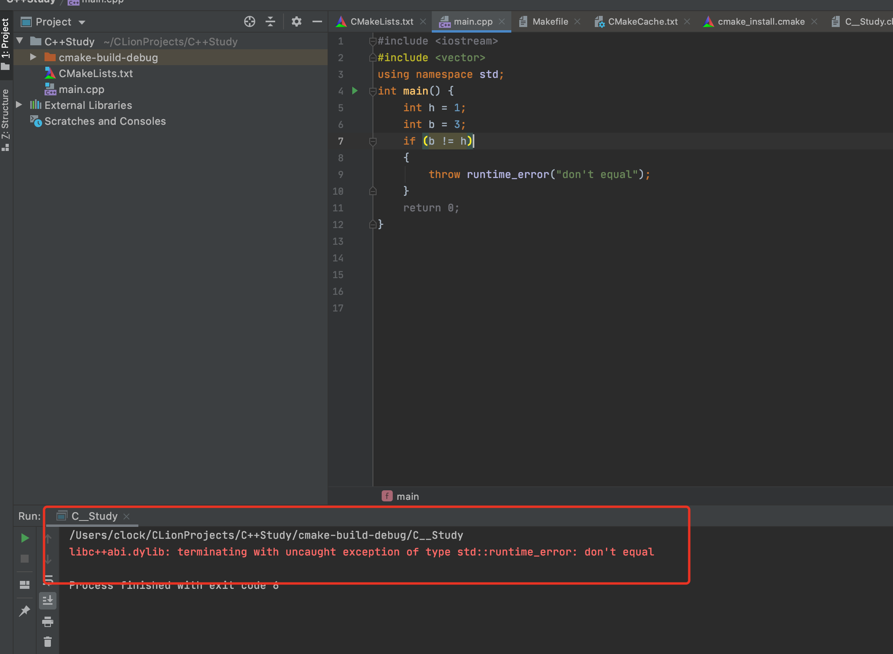
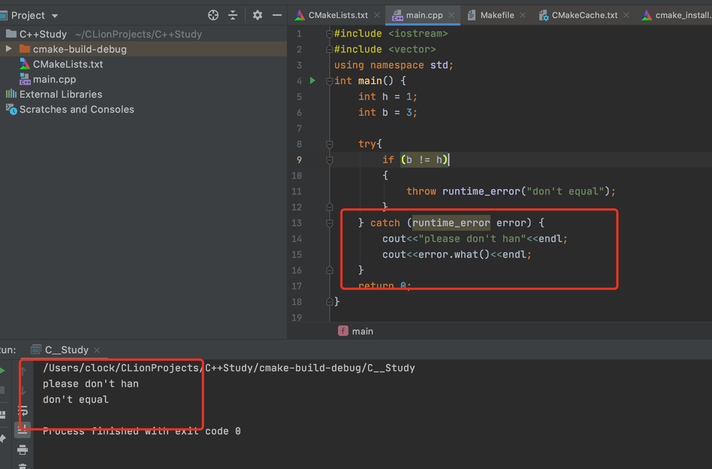

# C++Primer-第五章-语句

> 同样，由于和C语言存在大量重复，所以只记录重要的C++特性。

对于if-else语句中的else，C++规定**else与离它最近的尚未匹配的if匹配从而消除了程序的二义性。**

范围for语句：

~~~c++
for(declaration:expression)
{
	statement
}
~~~

这里我们引出了为什么不能通过for语句增加`vector`对象：

~~~c++
#include <iostream>
#include <vector>
using namespace std;
int main() {
    vector<int> a;
    for(auto b : a)
    {
        a.push_back(3);
    }
    for(auto b : a)
    {
        cout<<b<<endl;
    }
    return 0;
}
~~~

因为其等价于

~~~c++
    for (auto beg = a.begin(),end = a.end(); beg!=end; ++beg) {
        a.push_back(3);
    }
~~~

for语句里面预存了end的值，我们的push_back实际上会使得end()函数无效，我举出的例子十分不恰当，大家理解意思就好。。。。

## C++异常处理

* `throw表达式`
* `try语句块`，其以`try`开始，以`catch`结束，`catch`用来处理异常。
* `异常类`，用于在`throw`表达式和相关的`catch`子句之间传递异常信息。

`throw`：

~~~c++
    int h = 1;
    int b = 3;
    if (b != h)
    {
        throw runtime_error("don't equal");
    }
~~~

抛出一个类型`runtime_error`的对象。其是标准库异常类型的一种，定义在`stdexcept`头文件中，我们听过提供`string`对象或者C风格字符串来对该异常对象进行初始化。

`try语句块`

~~~c++
#include <iostream>
#include <vector>
using namespace std;
int main() {
    int h = 1;
    int b = 3;

    try{
        if (b != h)
        {
            throw runtime_error("don't equal");
        }
    } catch (runtime_error error) {
        cout<<"please don't han"<<endl;
        cout<<error.what()<<endl;
    }
    return 0;
}
~~~

其最大的差别在于添加了异常处理模块，**但是重点在于，每个标准库异常类都定义了一个名为what的成员函数，这些函数没有参数，返回值是C风格字符串(const char *)，其中runtime_error的what成员函数返回的是初始化一个具体对象的时候所用的string对象的副本**。

`如何寻找处理代码？`

这一点其实涉及到的有C++可能引发的漏洞。

寻找处理代码的过程其实和函数调用链刚刚相反，当异常被抛出的时候：

* 首先搜索抛出该异常的函数。
* 没有找到匹配的`catch`语句，那么终止该函数。
* 在调用上述函数的函数里面继续寻找，逐层回溯。
* 如果最后没找到，程序转到名为`terminate`的标准库函数，改函数和系统有关，一般情况下将导致程序非正常退出。

## 标准异常

C++标准库提供一组类，定义在四个头文件里面：

* `exception`头文件定义了最通用的异常类`exception`，它只报告异常的发生并不提供额外信息，。
* `stdexcept`，定义了几种常见异常类。
* `new`头文件定义了`bad_alloc`异常类型。
* `type_info`头文件定义了`bad_cast`异常类型。

`stdexcept`头文件

~~~c++
exception   //常见问题
runtime_error  //运行时检测出的错误
range_error  //运行时错误，生成的结果超出了有意义的值域范围。
overflow_error  //运行时错误：计算上溢
underflow_error  //运行时错误：计算下溢
logic_error  //程序逻辑错误
domain_error  //逻辑错误，参数对应的结果值不存在
invalid_argument  //逻辑错误：无效参数。
length_error  // 逻辑错误：试图创建一个超出该类型的最大长度的对象。
out_of_range  //逻辑错误：使用一个超出有效范围的值。
~~~

标准库异常定义的运算：

​	创建拷贝异常对象，以及为异常类的对象赋值。

​	注意：我们只能以默认初始化的方式初始化`exception`和`bad_alloc`和`bad_cast`对象，不能为其提供初始值，其它异常对象刚好相反，我们应该使用`string`对象或者`C风格字符串`来初始化异常对象。

​	`what`成员函数，在可以初始化的类里面一般返回相关初始化字符串，对于只能执行默认初始化的异常类来说，其返回的内容由系统决定。

