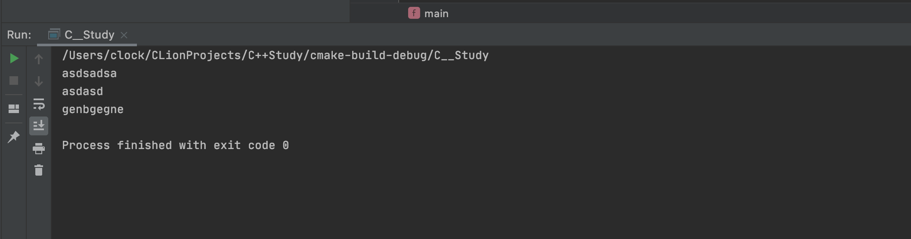

# C++Primer-第六章-函数

> 老样子，类似C的基础不谈。

执行函数使用`()`，今天才知道它名字：调用运算符。

## const形参和实参

当用实参初始化形参的时候回忽略掉顶层`const`，这一点其实适用于很多初始化的过程，可以说是形参的`顶层const`被忽略掉了，当形参有顶层const的时候，传给它`常量对象`或者`非常量对象`都可以。

## 含有可变形参的函数

C++11提供了两种主要方法：

* 如果所有的实参类型相同，可以传递一个名为`initiallzer_list`的标准库类型。
* 如果实参的类型不同，我们可以编写一种特殊的函数，也就是所谓的可变参数模板。
* C++还有一种特殊的形参类型（省略符），可以用它来实现可变数量的形参。

`initializer_list`形参：

函数的实参数量未知，但是全部实参的类型都相同，我们可以使用`initializer_list`形参，这是一种标准库类型，用于表示某种特定类型的值的数组。

* `initializer_list`和`vector`一样是一种模板类型。

~~~C++
#include <iostream>
#include <vector>
using namespace std;
int a(initializer_list<string> a){ //默认初始化，是个空列表
    initializer_list<string> s{"asda","asdsa"};  // s的元素数量和初始值一样多，s的元素是对应初始值的副本，列表中的元素是const
    initializer_list<string> s2(s); //拷贝或者赋值一个initializer_list不会拷贝列表中的元素
    initializer_list<string> s3 = s2;  //拷贝后原始列表和副本共享元素。
    auto size = s.size();  //大小
    auto beg = s.begin(); //指向首元素的指针
    auto end = s.end(); //指向尾元素下一个位置的指针
    for(auto go : a)
    {
        cout<<go<<endl;
    }
    return 0;
}
int main() {
    a({"asdsadsa","asdasd","genbgegne"});

    return 0;
}
~~~

值得注意的是：同时也可以包含其他类型的形参奥。

~~~c++
int a(initializer_list<string> a,int c);
~~~

`形参省略符`：

形式如下：

~~~c++
void foo(parm_list,...);
void foo(...);
~~~

第一种是指定了部分形参，指定的形参会进行类型检查，但是省略符对应的形参没有参数类型检查，第一种形式的实参里面，形参声明的逗号是可选的。

ps : 这在C源码里面很常见，特别是格式化字符的源码里面。

## 函数返回值

* 不要返回局部对象的引用或者指针，这也太好理解了，因为函数执行完栈空间回收。

* 列表初始化返回值（这个主要是配合`vector`这些容器的）

  * ~~~c++
    vector<int> get()
    {
        return {2,1};
    }
    ~~~

`返回数组指针`：

重要概念

~~~c++
int *p[10]; //包含10个指针的数组
int (*p)[10];  //一个指针指向一个数组，这个数组有十个元素。
~~~

那么我们如果想定义一个返回数组指针的函数，则数组的维度必须跟在函数名字之后，然而，函数的形参列表也跟在函数名字后面且形参列表应该先于数组维度。

~~~c++
Type (*function(parameter_list)) [dimension]
~~~

~~~c++
int (*func(int i))[10];
~~~

注意最外面的括号不能丢，否则就会变成指针的数组。

`使用尾置返回类型`

~~~c++
auto func(int i) -> int(*)[10];
~~~

作用同上。

## 函数重载

多说一句：注意实参传输给形参的过程中`顶层const`会丢失。

~~~c++
const string &func(string s1,string s2)
{
    return s2;
}
const string &func(const string s1,const string s2)
{
    return s1;
}
~~~

上述就是错误的。

`const_cast和重载`

在函数重载里面，`const_cast`可以帮我们实现很有用的常量转换。

## 内联函数

在函数声明中加上`inline`关键字。

`constexpr`函数是指可以用于常量表达式的函数。其约定如下：

* 函数的返回值和所有形参 的类型都必须是字面值类型
* 函数体中必须有且只有一个`return`语句。
* `constexpr`函数被隐式的指定为内联函数。

## 调试帮助（重点）

`assert预处理宏`：头文件`cassert`

`assert`其实是一个预处理变量，行为有点类似内联函数，其使用一个表达式作为它的条件。

~~~c++
assert(expr);
~~~

`NDEBUG`预处理变量

`assert`的行为依赖于一个名为`NDEBUG`的预处理变量的状态，如果定义了`NDEBUG`变量，那么`assert`什么也不做，默认状态下没有定义改变量。

~~~C++
#define NDEBUG  \\这样其实就是关闭了assert
~~~

## 预处理器定义的重要名字

* 编译器为每个函数都定义了`__func__`变量，这是一个`const char`的静态数组，用于存放函数名字。
* `__FILE__`存放文件名的字符串的字面值
* `__LINE__`存放当前行号的整形字面值。
* `__TIME__`存放文件编译时间的字符串字面值
* `__DATE__`存放文件编译日期的字符串字面值

## 函数指针

> 这个学过多次，但是经常用，记录一下

~~~c++
bool (*pf)(string s1,string s2);
~~~

记得括号不能少，否则就是一个返回值为`bool 指针`的函数。

`返回指向函数的指针`

~~~c++
using f1 = int(int* ,int); //F是函数类型，不是指针
using PF = int(*)(int *,int); //PF是指针类型
~~~

那么我们就可以这样定义一个返回指向函数的指针

~~~c++
PF func(int); 
f1 *func(int);
~~~

还有这样

~~~c++
auot f1(int) -> int (*)(int *,int);
~~~

同时可以利用`decltype`

~~~c++
string::size_type sumlen(const string&,const string&);
string::size_type larlen(const string&,const string&);
decltype(sumlen) *getFunc(const string &);
~~~

我本来好奇为啥返回的不是`指向string::size_type`的指针，后来发现`decltype`返回的是函数类型，那么显示的加上`*`之后就返回的是函数指针了。。。

