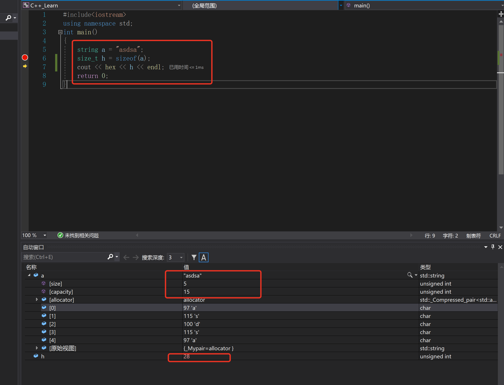

# C++Primer-第四章

前面很多其实和C类似，推算也能推算出来，所以就不记录了，值记录一些重要的点。

* `sizeof()`运算符返回的值是一个`size_t`类型。
  * 对指针进行`sizeof`得到指针本身的空间大小，。
  * 对指针解引用进行`sizeof`得到所指向对象的大小，但是指针不需要有效。
    * `sizeof`不会真正的求运算对象的值，所以指针实际上并没有解引用，`sizeof`不需要真的解引用指针也能知道它指向的对象类型。
  * 对`string`对象和`vector`对象进行`sizeof`操作，只能返回改类型固定部分的大小，不会计算对象中元素占用了多大的空间。

 ## 整形提升

这个其实已经遇见过多次了，但是只是第一次遇见详细概念，记录一下：

`整形提升`负责把小整数类型转化为较大的整数类型，对于`bool, char, signed, char, unsign char, short, unsigned short`只要他们的值可以存储在`int `里面，他们就会提升为`int`类型，否则提升为`unsigned int`类型，所以`Flase`提升为0,`True`提升为1.

较大的`char`类型，比如`wchar_t , char16_t , char32_t`提升成为`int ,signed int,long ,unsigned long ,long long ,unsigned long long`中最小的一种类型，前提是转换后的类型要可以容纳原类型所有可能的值。

## C++显示类型转换

除了类C的显示强制类型转换，C++有自己的强制转换方法。

形式如下：

~~~c
cast-name<type>(expression);
~~~

* type是指转换的目标类型，expression是要转换的值。
* 如果`type`是引用类型，那么结果是左值。
* cast-name指定了执行的是那种变换:
  * `static_cast`
  * `dynamic_cast`
  * `const_cast`
  * `reinterpret_cast`

`static_cast`:

 任何有明确定义的类型转换，不能包含`底层const`。

~~~c++
    int a = 10;
    int b = 2;
    double h = static_cast<double>(a) / b;
~~~

如上，帮助我们实现浮点数除法。

~~~c++
    double h = 1.2;
    void *p = &h;
    double b = *static_cast<double *>(p);
~~~

`const_cast`:

`const_cast`只能改变运算对象的底层const.

~~~c++
    const char *pc;
    char *p = const_cast<char *>(pc);
~~~

常量对象变为非常量 称为`去掉const性质`,同时值得注意的是不可以使用`const_cast`来改变变量类型。

`const_cast`和`static_cast`比较：

~~~c++
    const char *pc;
    char *q = static_cast<char *>(pc);  //错误,其不能去掉const属性。
    static_cast<string>(pc); //正确，字面值转换为string
    const_cast<string>(pc); //错误，不能改变pc的类型。
~~~

`reinterpret_cast`:

这个主要实现指针之间的类型转换。

~~~c++
    int *p;
    char *pc = reinterpret_cast<char *>(p);
~~~

我们需要知道，这样引发的类型转换不改变指针本身指向的值。（这其实想想就是必然的）。