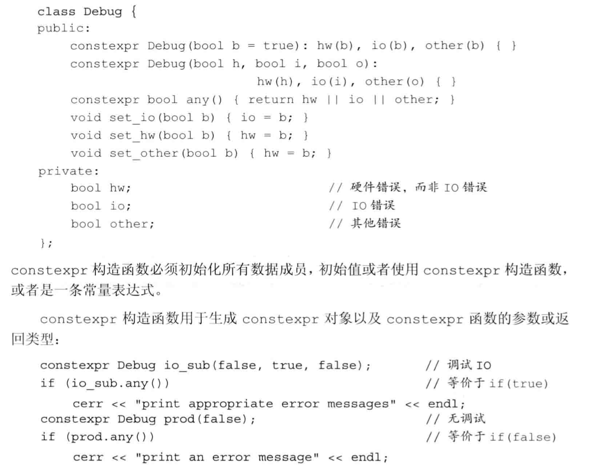

## C++primer-第七章-类

## this

this形参是隐式定义的。任何自定义名为`this`的参数或者变量行为都是非法的，它是一个常量指针。

成员还是在被调用的时候，会有一个`this`指针来访问调用它的那个对象。

`函数的类外定义`

~~~c++
class book{
    int add(int a,int b);
};
int book::add(int a, int b) {
    return a+b;
}
~~~

`默认构造函数`

~~~c++
class book{
    book() = default;
    int add(int a,int b);
};
~~~

构造函数不能被声明成`const`类型，当我们创建一个类的`const`对象的时候，直到构造函数初始化完成，对象才可以真正的取得`常量`属性，因此`构造函数`在初始化过程中可以对`const`对象写值。

当我们声明了一个构造函数的时候，编译器不再自动的生成默认构造函数，我们需要显示的成明出来。

~~~c++
book() = default;
~~~

`构造函数初始值列表`

~~~c++
    Sales_data(string &s):bookNo(s){};
~~~

当某个数据成员被构造函数初始值列表忽略的时候，它将以默认构造函数相同的方式进行隐式初始化。

`class和struct`的差别：

唯一的区别在于访问权限控制

* 类可以在它的第一个访问说明符（public , private）之前定义成员，对这种成员的访问方式依赖于类的定义方式。
* 使用`struct`那么第一个访问说明符之前的成员是`public`的，但是`class`的话是`private`的

> 那么我们在编程的时候如果希望类的所有成员是`public`的时候使用`struct`,希望成员是`private`那么就是`class`.

`友元`

~~~c++
class Sales_data{
    friend Sales_data add(const Sales_data&,const Sales_data&);
    friend std::istream &read(std::istream&,Sales_data&);
    friend std::ostream &print(std::ostream&,const Sales_data&);

public:
    Sales_data() = default;
    Sales_data(const string &s,unsigned n,double p);
    Sales_data(string &s):bookNo(s){};
    Sales_data(std::istream&);
    std::string isbn() const {return bookNo};
    Sales_data &combine(const Sales_data&);

private:
    string bookNo;
    unsigned units_sold = 0;
    double revenue = 0.0;
};
Sales_data add(const Sales_data&,const Sales_data&);
std::istream &read(std::istream&,Sales_data&);
std::ostream &print(std::ostream&,const Sales_data&);
~~~

可以看到这些`add,read,print`函数可以访问类的私有成员，`友元`不是类的成员也不受它所在区域的访问控制权限的限制。

### 类的其他特性

~~~c++
#include<iostream>
using namespace std;
class Screen{
public:
    typedef string::size_type pos; //通过把pos定义成public成员可以隐藏Screen的实现细节
    Screen() = default; //我们提供了一个构造函数，编译器不会自动生成默认的构造函数，如果需要必须显示的声明出来。
    Screen(pos ht,pos wd,char c):height(ht),width(wd),contents(ht *wd,c){} //cursor成员已经显示的初始化为0
    char get() const {return contents[cursor];}
    inline char get(pos ht,pos wd) const ;
    Screen &move(pos r,pos c);
private:
    pos cursor = 0;
    pos height = 0,width = 0;
    string  contents;
};

~~~

* 定义在类内部的成员函数默认是`inline`的。

`可变数据成员`

* `mutable`关键字

一个可变数据成员不会是`const`的，即使它是`const`对象的成员。

~~~c++
class test{
public:
    void some_member() const ;
    void print(){
        cout<<access_ctr<<endl;
    }
private:
    mutable size_t access_ctr = 0;
};
void test::some_member() const {
    ++access_ctr;
}
int main()
{
    test a;
    a.some_member();
    a.print();
    return 0;
}
~~~

可以看到尽管函数为`const`标识的`只读`函数，但是其依然可以修改可变数据成员。

`类初始值`

~~~c++
class Window_mgr{
private:
    vector<Screen> screens{Screen(24,80,' ')};
};
~~~

这个好理解，就是使用类套用实现初始化了。

`返回*this的成员函数`

~~~c++
inline Screen &Screen::set(char c) {
    contents[cursor] = c;
    return *this;
}
inline Screen &Screen::set(pos r, pos col, char ch) {
    contents[r*width + col] = ch;
    return *this;
}
~~~

set成员函数返回的是调用`set`的对象的引用。如果没有`&`那么将会返回一个对象的副本。

`从const成员函数返回*this`

成员函数为`const`，那么返回的`this`指针就是`const`类型，其对应的对象也是`const`类型的。

`基于const的重载`

区别于上面的`const`类型返回值的成员函数，加入成员函数本事是`const`的，那么它就会实现重载，同时：

* 非常量版本的函数对常量对象是不可用的。
* 可以再非常量对象上调用常量版本或者非常量版本。

常量函数：

~~~c++
    inline char get(pos ht,pos wd) const ;
~~~

const在后面。

`类的声明`

前向声明:

~~~c++
class Link_Screen;
~~~

如果没有对其定义，我们只能有以下操作：

* 定义指向这种类型的引用或者指针。
* 也可以声明（不能定义）使用该`不完全类型`作为参数或者返回值的函数。

因为编译器并不知道它的空间大小和成员。

其好处在于**一个类的名字出现之后，它被认为是声明过的，此时此类可以允许包含指向自身类型的指针或者引用。**

~~~c++
class Link_Screen{
	Screen window;
	Link_Screen *next;
	Link_Screen *prev;
};
~~~

`类之间的友元关系`

~~~c++
class Screen{
public:
    typedef string::size_type pos; //通过把pos定义成public成员可以隐藏Screen的实现细节
    Screen() = default; //我们提供了一个构造函数，编译器不会自动生成默认的构造函数，如果需要必须显示的声明出来。
    Screen(pos ht,pos wd,char c):height(ht),width(wd),contents(ht *wd,c){} //cursor成员已经显示的初始化为0
    char get() const {return contents[cursor];}
    inline char get(pos ht,pos wd) const ;
    Screen &move(pos r,pos c);
    friend class Window_mgr; // 友元
private:
    Screen &set(char);
    Screen &set(pos, pos , char);
    pos cursor = 0;
    pos height = 0,width = 0;
    string  contents;
};
class Window_mgr{
public:
    using ScreenIndex = vector<Screen>::size_type ;
    void clear(ScreenIndex);

private:
    vector<Screen>screens{Screen{24,80,' '}};
};
void Window_mgr::clear(ScreenIndex i) {
    Screen &s = screens[i];
    s.contents = string(s.height * s.width,' ');
}
~~~

可以看到我们在`window_mgr`里面修改了` Screen`类里面的私有成员变量，如果在`Screen`类里面没有进行友元的声明的话，那么是不可能编译成功的。

> 友元关系不存在传递性，如果`Window_mgr`有它自己的友元，则这些友元并不能理所当然的访问screen的权限。

`令成员函数作为友元`

~~~c++
class Screen{
	friend void Window_mgr::clear(ScreenIndex);
};
~~~

 程序设计方式：

* 首先定义`Window_mgr`类，其中声明`clean`函数，但是不进行定义。在clean使用Screen成员之前必须声明`Screen`类
* 定义`Screen`类，并且声明`clean`为友元
* 定义`clean`函数，此时它才可以使用`Screen`成员。

## 委托构造函数

> C++11开始可以定义所谓的`委托构造函数`

~~~c++
class Sales_data{
public:
    Sales_data(string s,unsigned cnt,double price):bookNo(s),units_sold(cnt),revenue(cnt *price){}
    //其余构造函数全部委托给另一个构造函数
    Sales_data():Sales_data("",0,0){}  //定义默认构造函数，委托给上面三个参数逇版本，下面的类似
    Sales_data(string s) : Sales_data(s,0,0){} //一个参数的构造函数，同样委托给三个参数逇构造函数
    Sales_data(istream &s):Sales_data(){read(s,*this);} //委托给默认构造函数，当默认构造函数完成之后开始执行构造函数体里面的内容。
private:
    string bookNo;
    unsigned units_sold;
    double revenue;
};
~~~

`默认构造函数的作用`

默认构造函数发生条件：

* 默认初始化

  

* 值初始化

`类类型隐式转换`

~~~c++
using namespace std;
class Sales_data{
public:
    Sales_data(string s,unsigned cnt,double price):bookNo(s),units_sold(cnt),revenue(cnt *price){}
    //其余构造函数全部委托给另一个构造函数
    Sales_data():Sales_data("",0,0){}  //定义默认构造函数，委托给上面三个参数逇版本，下面的类似
    Sales_data(string s) : Sales_data(s,0,0){} //一个参数的构造函数，同样委托给三个参数逇构造函数
   // Sales_data(istream &s):Sales_data(){read(s,*this);} //委托给默认构造函数，当默认构造函数完成之后开始执行构造函数体里面的内容。
    Sales_data& combine(const Sales_data&);
private:
    string bookNo;
    unsigned units_sold;
    double revenue;
};
int main()
{
    Sales_data A;
    string null_book = "9-999-99999-9";
    A.combine(null_book);
    return 0;
}
~~~

这其中也包含了转换构造函数，同时`null_book`隐式的从`string`转换到`Sales_data`类。但是**只允许一步类类型转换**。

但是这个过程中生成的`Sales_data`类的`null_book`将值添加到`A`里面之后被抛弃。

有时候我们为了避免隐式的类类型转换，我们可以在构造函数前面加上`explicit`声明，声明之后的类构造函数只能用于直接初始化，此时我们可以使用显示的构造函数，

~~~c++
A.combine(Sales_data(null_book));
~~~

`标准库中含有显示构造函数的类`

* 接受一个单参数的`const char *`的`string`构造函数，不是`explicit`的
* 接受一个容量参数的`vector`构造函数是`explicit`的。

## 聚合类

聚合条件：

* 所有成员都是`public`的
* 没有定义任何构造函数
* 没有类内初始值
* 没有基类，也没有`virtual`函数。

`字面值常量`

数据成员都是字面值类型的`聚合类`就是字面值常量类。

或者满足以下要求：

* 数据成员必须是字面值类型的。
* 类必须至少含有一个`constexpr`构造函数
* 如果一个数据成员含有类内初始值，则内置类型成员的初始值必须是一条常量表达式。或者如果成员属于某种类类型，则初始值必须使用成员自己的`constexpr`构造函数。
* 类必须使用析构函数的默认定义，该成员负责销毁类的对象。

constexpr构造函数

`类的静态成员`

定义的时候使用`static`关键字

~~~c++
#include <iostream>
#include <vector>

using namespace std;
class Account{
public:
    void calculate(){amount+= amount*interestRate;}
    static double rate(){return interestRate;}
    static void rate(double );

private:
    string owner;
    double amount;
    static double interestRate;
    static double initRate();
};
int main()
{
    return 0;
}
~~~

类内的静态成员存在于任何对象之外，对象中不包含任何与静态数据成员有关的数据。

* 类都存在两个数据成员`owner`和`amount`
* 但是只存在一个`interestRate`对象被所有的`Account`对象共享。

`使用类的静态成员`

~~~c++
double r;
r = Account::rete();
~~~

`定义类静态成员`

~~~c++
void Account::rate(double newRate)
{
	interestRate = newRate;
}
~~~

`static`关键字只出现在类内部的声明语句。同时静态数据成员不属于类的任何一个对象，所以不由类的构造函数初始化。

`静态成员能用于某些场景，但是普通成员不可以`

~~~c++
class Bar{
	public:
		//...
	private:
		static Bar mem1; //静态成员可以是不完全类型
		Bar *mem2; //指针成员可以是不完全类型
		Bar mem3; // 数据成员必须是完整类型，所以这个错误
};
~~~

同时静态成员可以作为默认实参，但是普通成员不可以

~~~c++
class Screen{
	public:
	 Screen& clear(char = bkground);
	private:
		static const char bkground;
}
~~~

普通成员不可以作为默认的实参，因为它本事就是对象的一部分，这么做的结果是无法真正提供一个对象以便从中获取成员的值，最终将引发错误。

