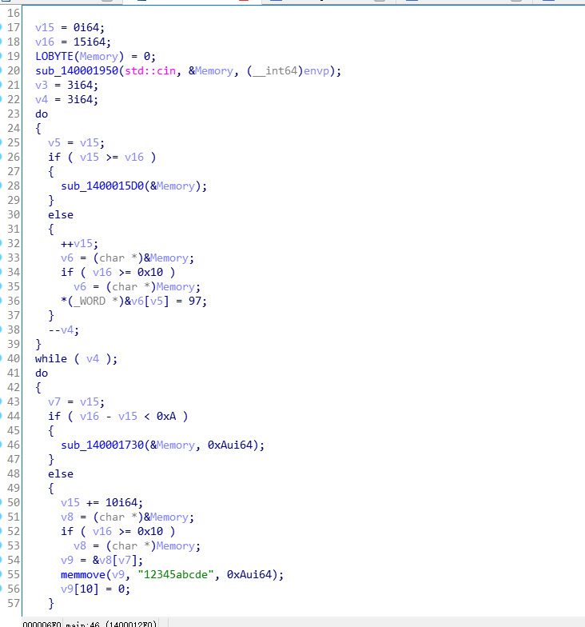
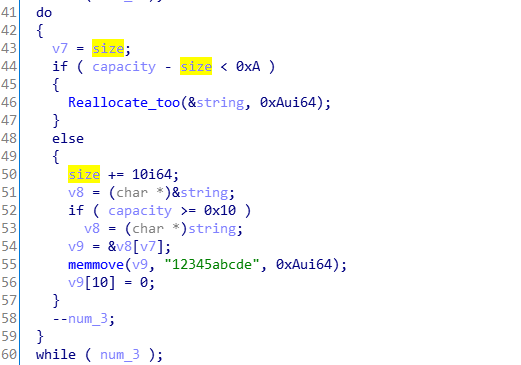

# C++逆向学习-string

测试代码

~~~c++
#include<iostream>
#include<string>
using namespace std;
int main()
{
	string a("asdasd");
	cout << a << endl;
	return 0;
}
~~~

我们下断点看`string`类型的变量的结构究竟是怎么样的：

可以看到还是十分繁琐的，下面解释一下：

* size : 当前字符串的长度。
* capacity : 当前类的最大容量，可以看到capacity是比size大的多的。
* allocator : 是空间配置器，里面可以看到每个字符的单独显示。

可以看到空间配置器里面存储有字符串的地址和一些相关信息：

同时字符串同样以`\x00`进行结尾。

## 扩容机制

> capacity显示了更大的空间，我们研究一下：

~~~c++
#include<iostream>
#include<string>

using namespace std;
int main()
{
	string str;
	for (size_t i = 0; i < 100; i++)
	{
		str += "a";
		cout << "size : " << str.size() << " capacity : " << str.capacity() << endl;
	}
	system("pause");
	return 0;
}
~~~

可以看到`capacity`的值在不断的发生变化 15 --> 31 ---> 47----> 70 ---> 105。

我们可以通过调试分析整个过程的变化：

第一个0xf是字符串长度，第二个0xf是`capacity`,那如果继续增加字符串会怎么样呢？

可以看到`capacity`直接变成了0x1f,同时原来的字符串也被一个地址覆盖了，这个地址正是新字符串的地址

这样我们就可以总结：

> string 类通过不断开辟新的内存空间来容纳更大的字符串，而在第一次开辟的地方保留有将来动态开辟的内存的地址。

## IDA窥探

### VS版本

~~~c++
#include<iostream>
#include<string>

using namespace std;
int main()
{
	string input;
	cin >> input;
	for (size_t i = 0; i < 3; i++)
	{
		input += 'a';
	}
	for (size_t i = 0; i < 3; i++)
	{
		input.append("12345abcde");
	}
	cout << input << endl;
	return 0;
}
~~~

> vs 2019 x64 debug 版本  IDA pro 7.0

找到main函数，F5之后

可以看到命名和逻辑都十分的不清晰，我们简单修复之后，发现没什么可说了，跟源码差不多，看看`release`版本的。

> vs 2019 x64 release 版本  IDA pro 7.0

发现和`debug`版本差距很大，先对符号进行一下恢复吧。。恢复之后进行分析，大致分为3部分：

可以看到，首先是一个输入操作，其次对`size`和`capacity`进行比较，如果size较大，那么就对string进行重新分配，然而`size`符合标准的话，就是我们源代码里面的逻辑操作了，同时值得注意的是，我们可以看到`capacity`是不是大于0xf决定了两种不同的字符串操作，正和我们刚开始的想对应，如果大于0xf的话，那么就会在string的起始地址找到分配的新的内存地址进行操作。

同时看汇编的时候了解到一个很有用的指令：

~~~asm
cmovnb  // 无符号大于等于时传送
~~~

~~~asm
lea     rax, [rcx+1]
mov     [rsp+68h+size], rax
lea     rax, [rsp+68h+string]
cmp     rdx, 10h
cmovnb  rax, [rsp+68h+string]
mov     word ptr [rax+rcx], 61h
jmp     short loc_14000131C
~~~

这就很完美的实现了上述的逻辑操作。

下面看第二部分：

对比源码我们可以看到，当`capacity-size`小于一次`append`的字符串长度的时候，它就会开始重新分配哦，其不一样的地方在于采用了`memmove`来实现字符串的写入，同时多了一个加上`\x00`的操作，上面没有是因为` *(_WORD *)&str_addr[_size] = 97;`这一个操作是WORD操作，小端序的时候不是直接加0了么。

第三部分：

这就是一个输出和一些关于`string`类型的检查和相关内存的释放操作了吧。

## g++版本

> 这个虚拟机有点卡，等明天mac出场调试吧。其实G++因为裸奔编译的缘故，其实代码比VS要直接太多了。