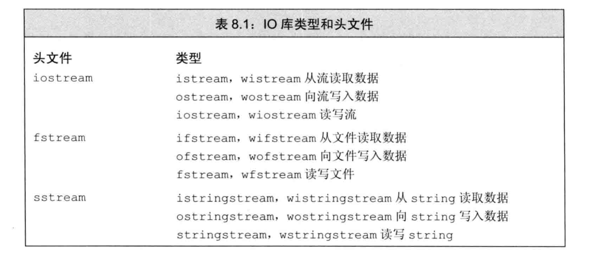
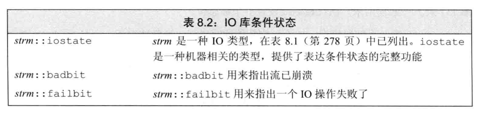
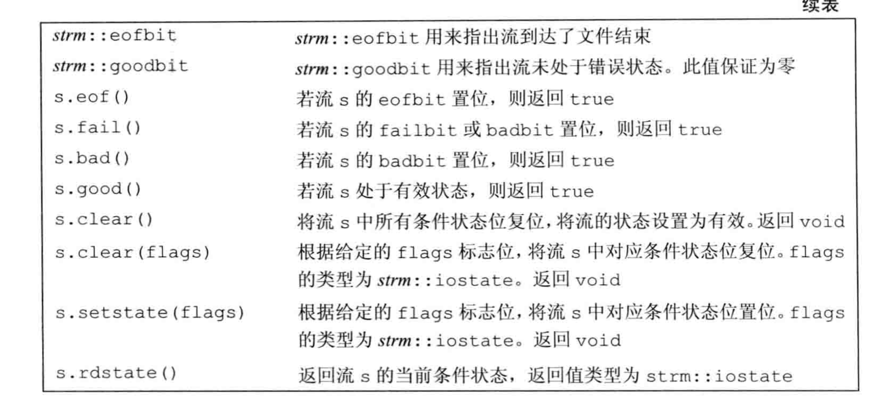

# IO库

## IO类

`wchar_t`类型的数据是宽字符版本类型，其相关函数也以`w`开始例如：`wcin,wcout`等等，同时宽字符版本的定义和普通的版本类型定义在同一个头文件里面。

`条件状态`

IO类定义了一些函数和标志，可以帮助我们访问和操作流的`条件状态`。

一个流一旦发生错误，其后续的IO操作都会失败。

我们可以使用把其结果当做条件来判断流的状态：

~~~c
while(cin>>a)
{
	...//执行语句
}
~~~

`查询流的状态`

`iostate`类型用一个位的集合提供了表达流状态的完整功能。其中IO库定义了4个iostate类型的constexpr值表示特定的位模式。这些值可以用来表示特定的IO条件，可以与位运算符一起使用来一次性检测或设置多个标志位。

标准库还定义了一组函数来查询这些标志位的状态：

* `good()`：所有错误位均未置位的情况下返回true.
* `bad(),fail(),eof()`则在对应错误位被置位的时候返回true，同时`badbit`被置位时`fail`也会返回true。

`管理条件状态`

流对象的`rdstate`成员返回一个`iostate`值，对应流的当前状态。

* `setstate`操作将给定条件位置位，表示发生了对应错误。
* `clear`成员是一个重载的成员。
  * 一个是不接受参数的版本，这个清除所有错误标志位。
  * 另一个是接受一个`iostate`类型的参数，表示流的新状态。

~~~c++
auto old_state = cin.rdstate(); //记住cin的当前状态。
cin.clear(); //使得cin有效
process_input(cin); //使用cin
cin.setstate(old_state);  //将cin置为原有状态
cin.clear(cin.rdstate() & ~cin.failbit & ~cin.badbit);//复位failbit和badbit，但保持其他标志位不变
~~~

`管理输出缓冲`

每个输出流都管理一个缓冲区。用来保存程序读写的数据。

导致缓冲区刷新的原因：

1. 程序正常结束。
2. 缓冲区满的时候
3. 使用操作符`endl`显示刷新缓冲区
4. 每个输出操作之后，可以用`unitbuf`设置流的内部状态，来清空缓冲区。默认情况下，对`cerr`是设置`unitbuf`的，因此写到`cerr`的内容都是立即刷新的。
5. 一个输出流可能被关联到另一个流。此时当读写被关联的流的时候

