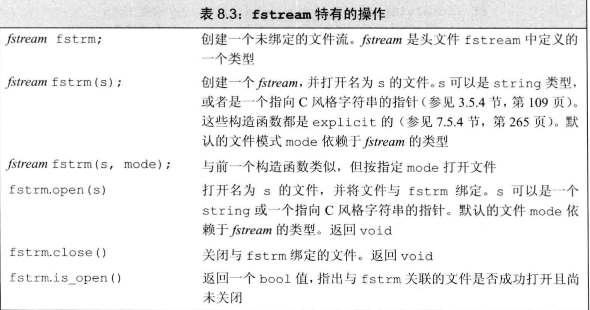
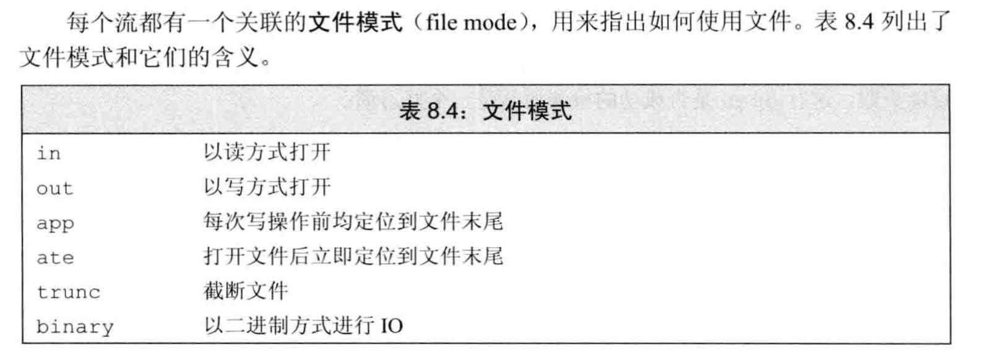
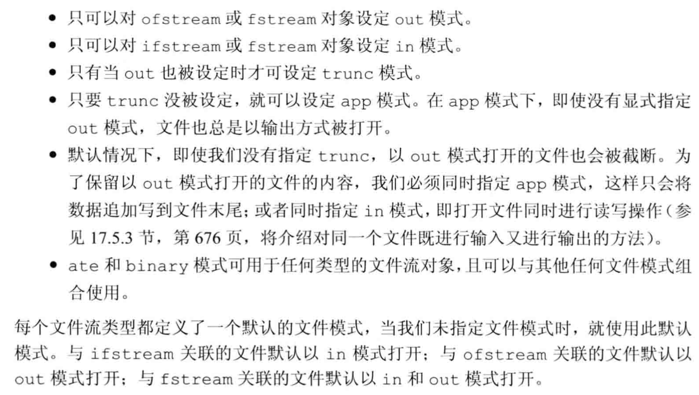

# IO库

## IO类

`wchar_t`类型的数据是宽字符版本类型，其相关函数也以`w`开始例如：`wcin,wcout`等等，同时宽字符版本的定义和普通的版本类型定义在同一个头文件里面。

`条件状态`

IO类定义了一些函数和标志，可以帮助我们访问和操作流的`条件状态`。

一个流一旦发生错误，其后续的IO操作都会失败。

我们可以使用把其结果当做条件来判断流的状态：

~~~c
while(cin>>a)
{
	...//执行语句
}
~~~

`查询流的状态`

`iostate`类型用一个位的集合提供了表达流状态的完整功能。其中IO库定义了4个iostate类型的constexpr值表示特定的位模式。这些值可以用来表示特定的IO条件，可以与位运算符一起使用来一次性检测或设置多个标志位。

标准库还定义了一组函数来查询这些标志位的状态：

* `good()`：所有错误位均未置位的情况下返回true.
* `bad(),fail(),eof()`则在对应错误位被置位的时候返回true，同时`badbit`被置位时`fail`也会返回true。

`管理条件状态`

流对象的`rdstate`成员返回一个`iostate`值，对应流的当前状态。

* `setstate`操作将给定条件位置位，表示发生了对应错误。
* `clear`成员是一个重载的成员。
  * 一个是不接受参数的版本，这个清除所有错误标志位。
  * 另一个是接受一个`iostate`类型的参数，表示流的新状态。

~~~c++
auto old_state = cin.rdstate(); //记住cin的当前状态。
cin.clear(); //使得cin有效
process_input(cin); //使用cin
cin.setstate(old_state);  //将cin置为原有状态
cin.clear(cin.rdstate() & ~cin.failbit & ~cin.badbit);//复位failbit和badbit，但保持其他标志位不变
~~~

`管理输出缓冲`

每个输出流都管理一个缓冲区。用来保存程序读写的数据。

导致缓冲区刷新的原因：

1. 程序正常结束。
2. 缓冲区满的时候
3. 使用操作符`endl`显示刷新缓冲区
4. 每个输出操作之后，可以用`unitbuf`设置流的内部状态，来清空缓冲区。默认情况下，对`cerr`是设置`unitbuf`的，因此写到`cerr`的内容都是立即刷新的。
5. 一个输出流可能被关联到另一个流。此时当读写被关联的流的时候,关联的流的缓冲区会被刷新。

`刷新缓冲群`

* `endl` 额外加一个换行，然后刷新缓冲区
* `ends`  格外加一个空字符，然后刷新缓冲区
* `flush`  刷新缓冲区，不添加任何额外的字符

`unitbuf 操作符`

它告诉流接下来的每次写操作之后都进行一次`flush`操作。而`nounitbuf` 操作符则重置流，使其恢复使用正常的系统管理的缓冲区刷新机制。

~~~c++
cout<<unitbuf; 
cout<<nounitbuf; //返回正常的缓冲方式
~~~

`关联输入和输出流`

当一个输入流被关联到一个输出流的时候，任何试图从输入流读取数据的操作都会刷新关联的输出流。标准库将cout和cin关联到一起，所以

~~~c++
cin >> ival;
~~~

上面的语句会导致cout的缓冲区被刷新。

> 交互式系统一般应该关联输入流和输出流。这意味着所有输出，包括用户提示信息，都会在读操作之前被打印出来。

`tie`有两个重载版本：

* 不带参数，返回指向输出流的指针。如果本对象当前关联到一个输出流，则返回的就是指向这个流的指针，如果对象未关联到流，则返回空指针。
* 接受一个指向`ostream`的指针，将自己关联到该ostream，`x.tie(&o)`将流x关联到输出流o。

总结，两个流相关联的意思就是一个流的读取操作都会刷新另一个关联的流。

## 文件输入输出

头文件`fstream`

* `ifstream` 从一个给定文件读取数据。
* `ofstream` 向一个给定文件写入数据。
* `fstream` 可以读写给定文件。

`fstream` 继承自`iostream` 类型

`使用文件流对象`

每个文件流类都定义了一个名为`open`的成员函数，它完成一些系统相关的操作，来定位给定的文件，并视情况打开为写或者读模式。

~~~c++
ifstream in(ifile); //构造一个ifstream并打开给定文件
ofstream out;  //输出文件流并未关联到任何文件
~~~

在上述代码里面创建文件流对象的时候，如果提供了一个文件名那么`open`会被自动调用。

`用fstream代替iostrean&`

在要求使用基类型对象的地方，我们可以使用继承类型的对象来代替。

继承关系：

* iostream -> fstream
* ostream -> ofstream
* istream -> ifstream

成员函数open和close

* 如果open失败那么`failbit`会被置位，所以我们要对open的调用进行检查。

~~~c++
ofstream out;
if(out) //检查open成功与否，如果成功了就可以使用了。
~~~

对一个已经打开的文件调用open会失败，并导致`failbit`被置位，随后的尝试使用文件流的操作都会失败。为了将文件流关联到另外一个文件，必须首先关闭已经关联的文件。一旦文件成功关闭，我们就可以打开新的文件。

`自动构造和析构`

 当一个`fstream`对象离开其作用域的时候，与之关联的文件会自动关闭。

`文件模式`

`以out模式打开文件会丢弃已有数据`

默认情况下，打开一个`ofstream`时，文件的内容会被丢弃。阻止一个ofstream清空文件内容的方法就是同时指定app模式：

## string流

`sstream`头文件定义了三个类型来支持内存IO，这些类型可以向string写入数据，从`string`读取数据，就像string是一个IO流一样。

* `istringstream` 从string读取数据
* `ostringstream`向string写数据
* `stringstream` 向string读写数据

