# 顺序容器

## 概述

* `string`和`vector` 将元素保存在连续的内存空间里面，由于元素是连续存储的，由元素的下标来计算其地址是非常快速的。但是在这两种容器的中间位置添加或删除元素就会非常耗时。
* `list` 和 `forward_list` 目的是让容器的任何位置的添加和删除操作都很快速，但是两个容器不支持随机访问，为了访问某个元素我们只能遍历整个容器。
* `deque` 较为复杂，与`string`和`vector`类似，`deque`支持快速的随机访问，同时中间位置添加或删除元素代价可能很高，但是其的两端添加或者删除元素都是很快的，与`list`和`forward_list`速度相当。

容器选择的基本原则：

* 除非有很好的理由选择其他的，否则就使用`vector`.

## 容器库概览

一般来说，每个容器都定义在一个头文件里面，文件名与类型名相同。

容器操作：

`迭代器`

迭代器返回由一对迭代器表示，两个迭代器分别指向容器中的元素或者是尾元素之后的位置，通常被称为`begin`和`end`。迭代器范围中的元素包含begin开始到end（不包括end）之间的所有元素。

通过类型别名，我们可以再不了解容器中元素的情况下使用它。如果需要元素类型，可以使用容器的`value_type` 。如果需要元素类型的一个引用，可以使用`reference`或`const_reference` 。

~~~c++
list<string>::iterator iter; //通过list<string>定义一个迭代器类型
vector<int>::difference_type count;//count是通过vector<int>定义的一个difference_type类型
~~~

`begin`和`end`成员

两者分别指向容器中的第一个元素和尾元素之后的位置的迭代器，他们都有自己不同的版本，以begin为例子。

~~~c++
list<string> a = {"Milton","Shakespare","Austen"};
auto it1 = a.begin(); // list<string>::iterator
auto it2 = a.rbegin(); // list<string>::reverse_iterator
auto it3 = a.cbegin(); // list<string>::const_iterator
auto it4 = a.crbegin(); // list<string>::const_reverse_itreator
~~~

`容器的定义和初始化`

每个容器类型都定义了一个默认构造函数，除了array之外，其他容器的默认构造函数都会创建一个指定类型的空容器，且都可以接受指定容器大小和元素的初始值的参数。

`与顺序容器大小相关的构造函数`

`标准库array具有固定大小`

~~~c++
array<int,42> //类型为：保存42个int的数组
~~~

虽然我们不能对内置数组类型进行拷贝或者对象赋值操作，但是array并无此限制。

~~~c++
int digs[10] = {0,1,2,3,4,5,6,7,8,9};
int cpy[10] = digs; //错误
array<int,10> digits = {0,1,2,3,4,5,6,7,8,9};
array<int,10> copy = digits; // 正确
~~~

`容器的赋值运算`

`使用assign（仅顺序容器）`

顺序容器（除了array）还定义了一个名为`assign`的成员，允许我们从一个不同但相容的类型赋值，或者从容器的一个子序列赋值。

assign操作用参数所指定的元素替换左边容器中的所有元素。

`使用swap`

调用swap之后，两个容器中的元素会被交换：

~~~c++
vector<string> svec1(10);
vector<string> svec2(24);
swap(svec1,svec2);
~~~

除了`array`外，swap不对任何元素进行拷贝，删除或插入操作，因此可以保证在常数时间内完成，元素不会移动意味着，除了string之外，指向容器的迭代器，引用和指针在Swap操作之后都不会失效。他们仍指向swap操作之前所指向的那些元素。

但是两个`array`的swap操作会真正的交换他们的元素。

`容器的比较操作`

## 顺序容器操作

`向顺序容器添加元素`

除了`array`以外，所有的标准库容器都提供灵活的内存管理，在运行时可以动态添加或者删除元素来改变容器大小。

感觉没啥好说的，多用用就知道了，上面么有的就是`erase`操作了，用来删除元素用的。

`特殊的forward_list`操作

forward_list是一个单项链表，无法简单的获取一个元素的前驱，所以在一个forward_list中添加或删除都是通过改变给定元素之后的元素来完成的。

其定义了以下操作：

* `insert_after`
* `emplace_after`
* `erase_after` 

举例子：当我们删除`elem3`的时候，应该用指向`elem2`的迭代器调用`erase_after` ,同时`forward_list`提供了`before_begin`返回一个首前的迭代器，这个迭代器允许我们在链表首元素之前并不存在的元素之后添加或删除元素。

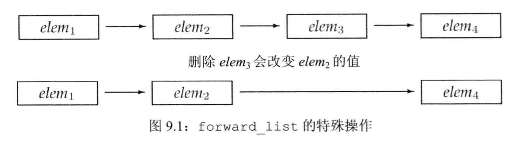

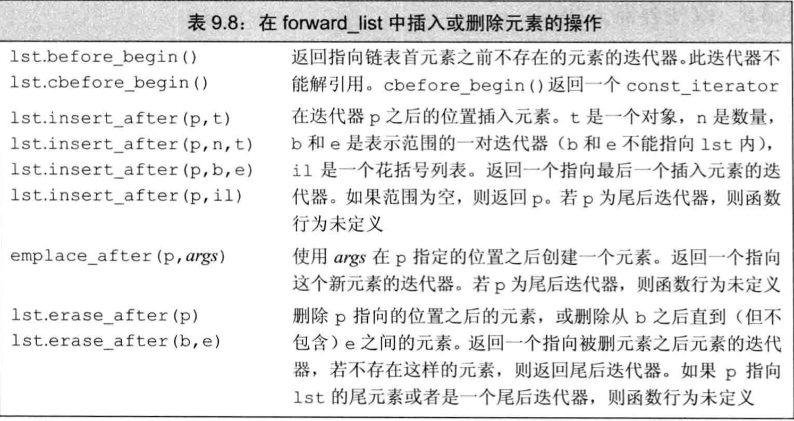

~~~c++
#include <iostream>
#include <vector>
#include <fstream>
#include <forward_list>
using namespace std;
int main()
{
    forward_list<int> flst = {0,1,2,3,4,5,6,7,8,9};
    auto prev = flst.before_begin();
    auto curr = flst.begin();
    while (curr!=flst.end()){
        if(*curr % 2){
            curr = flst.erase_after(prev); //返回一个指向被删除元素之后元素的迭代器。
        } else{
            prev = curr;
            ++curr;
        }
    }
    return 0;
}
~~~

`改变容器的大小`

array不支持resize;

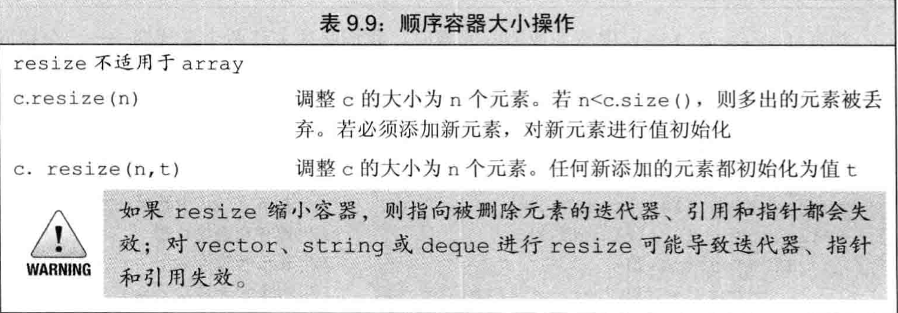

## vector对象是如何增长的

vector一般会分配比新的空间需求更大 的内存空间，用作备用。

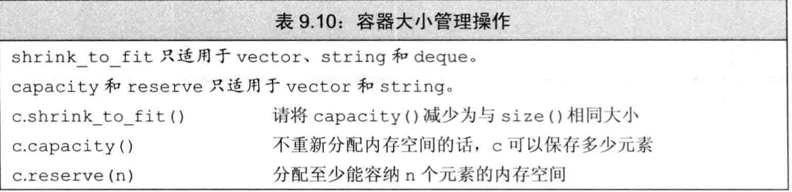

但是当所需的内存空间超过当前的容量的时候，`reserve`调用才会改变vector的大小，否则会什么也不做。

同样也不可以使用`reserve`减小容器预留的空间，在新的标准库里面，可以使用`shrink_to_fit`来要求`deque,vector,string`退回不需要的内存空间，但是事实上调用`shrink_to_fit`也并不一定退回内存空间。

> 详细可以看我对C++的逆向文章。

## 额外的string操作

`构造string的其他方法`

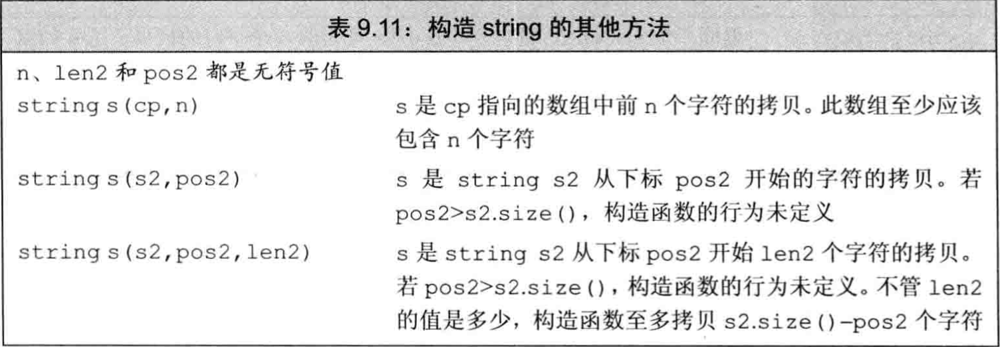

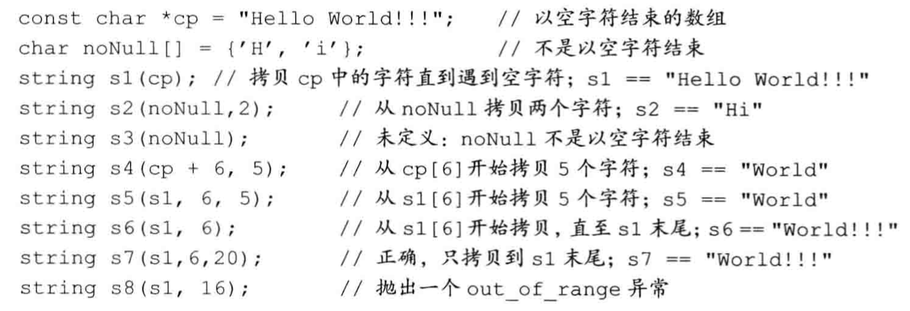

`substr`操作

~~~c++
string s("hello world");
string s2 = s.substr(0,5);
string s3 = s.substr(6); //从6截取到最后world
string s4 = s.substr(6,11);
string s5 = s.substr(12); //抛出out_of_orange异常
~~~

`改变string`的其他方法

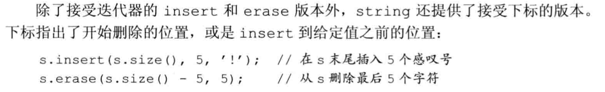

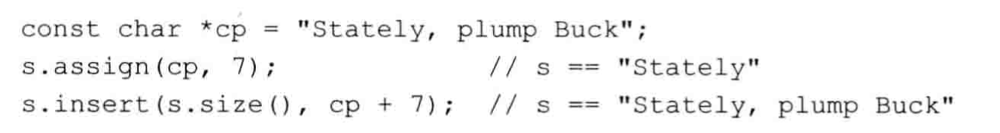

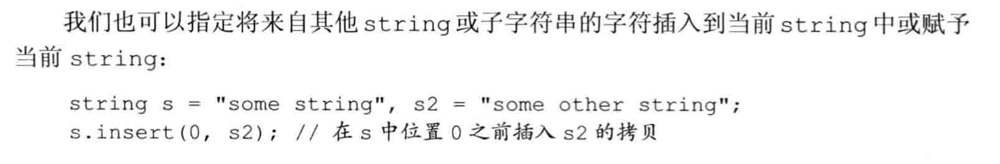

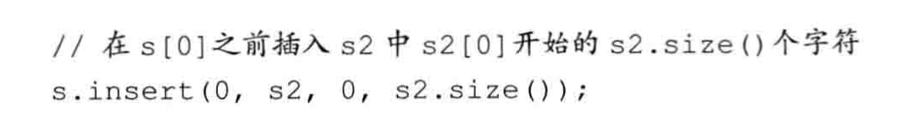

`append和replace函数`

看名字就知道啥意思，知道它有这个成员函数就可以了。

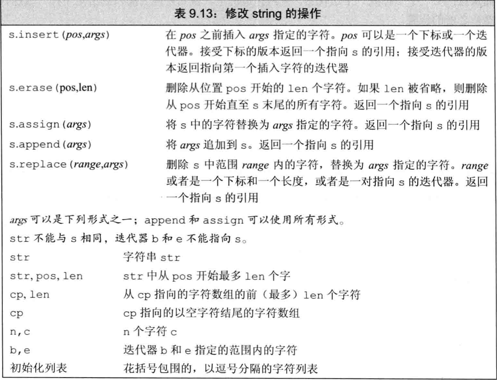

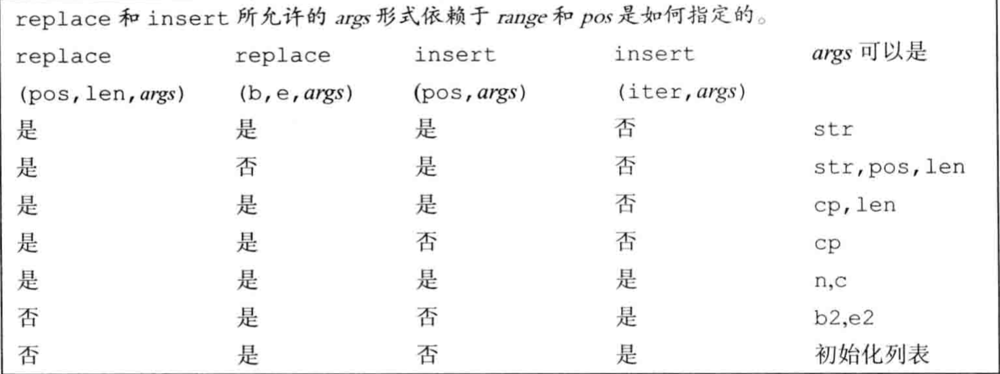

`string的搜索操作`

使用`find`成员函数。

一个更复杂的问题是查找给定字符串中任何一个字符匹配的位置。

~~~c++
#include <iostream>
#include <forward_list>
using namespace std;
int main()
{
    string number("0123456789"),name("r2d2");
    auto p = name.find_first_of(number);//这里有点难以理解，其代表搜索name中是否有与number中任意一个字符相匹配的位置，并返回改位置的下标，本例的输出为1
    cout<<p<<endl;
    return 0;
}
~~~

如果要搜索第一个不在参数中的字符，应该调用`find_first_not_of` 。例如，为了搜索一个string中第一个非数字的字符，可以do this

~~~c++
string dept("03714p3");
//返回 5，字符`p`的下标
auto pos = dept.find_first_not_of(numbers);
~~~

如果没有合适的结果的时候就会返回`string::npos`.

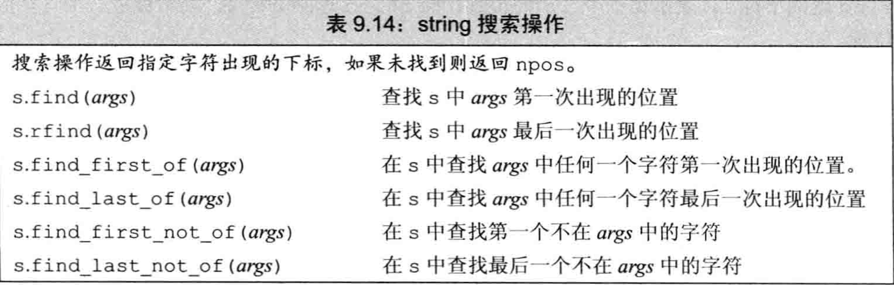

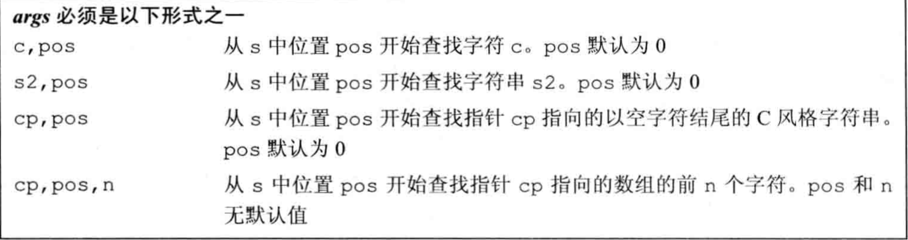

`指定开始从那里搜索`

这不过是一个重载吧，find_first_of(numbers,pos) , pos表示开始的位置。

`逆向搜索`

~~~c++
string river("Mississippi");
auto first_pos = river.find("is"); //返回1
auto last_pos = river.rfind("is"); //返回4 逆向搜索
~~~

同样的还有find_last_of系列函数。

`compare函数`

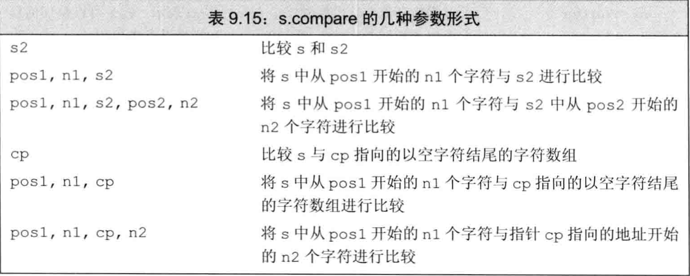

`数值转换`

~~~c++
int i = 42;
string s = to_string(i); //整数i转换为字符串的表示形式
double b = stod(s); //字符串转化为浮点数
~~~

## 容器适配器

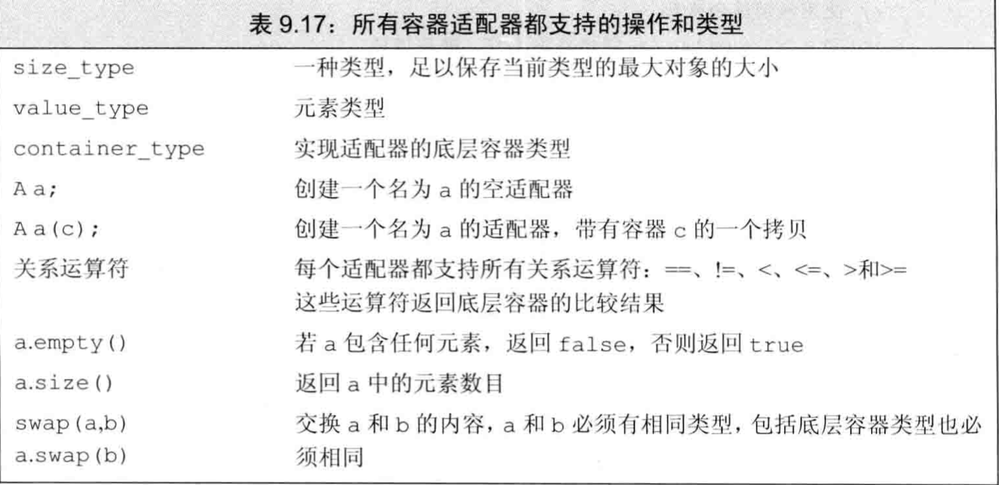

`定义一个适配器`

每个适配器含有两个默认的构造函数：

* 构造创建一个空对象
* 接受一个容器的构造函数拷贝该容器来初始化适配器。

~~~c++
stack<int> stk(deq);
~~~

我们可以再创建一个适配器的时候将一个命名的顺序容器作为第二个参数类型，来重载默认容器的类型。

~~~c++
stack<string,vector<string>> str_stk;
~~~

所有的适配器都要求容器具有添加和删除元素的能力以及访问尾元素的能力。所以，适配器不可构造在array上。

`栈适配器`

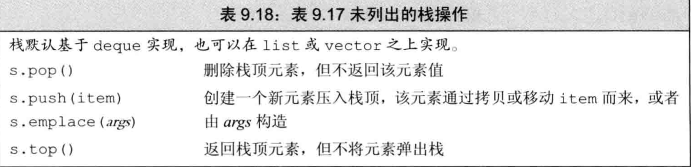

`队列适配器`

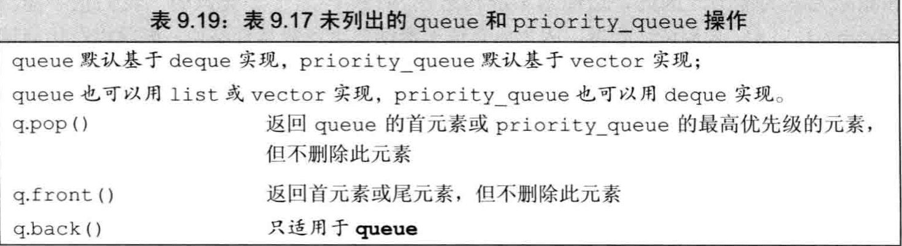

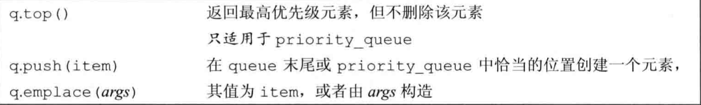

