# 顺序容器

## 概述

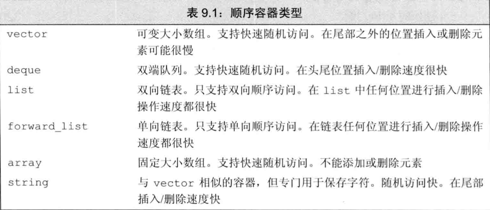

* `string`和`vector` 将元素保存在连续的内存空间里面，由于元素是连续存储的，由元素的下标来计算其地址是非常快速的。但是在这两种容器的中间位置添加或删除元素就会非常耗时。
* `list` 和 `forward_list` 目的是让容器的任何位置的添加和删除操作都很快速，但是两个容器不支持随机访问，为了访问某个元素我们只能遍历整个容器。
* `deque` 较为复杂，与`string`和`vector`类似，`deque`支持快速的随机访问，同时中间位置添加或删除元素代价可能很高，但是其的两端添加或者删除元素都是很快的，与`list`和`forward_list`速度相当。

容器选择的基本原则：

* 除非有很好的理由选择其他的，否则就使用`vector`.

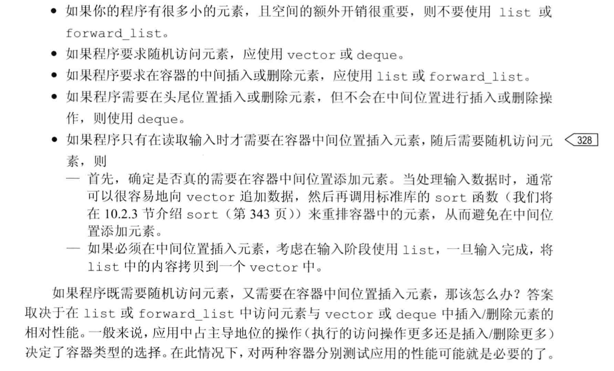

## 容器库概览

一般来说，每个容器都定义在一个头文件里面，文件名与类型名相同。

容器操作：

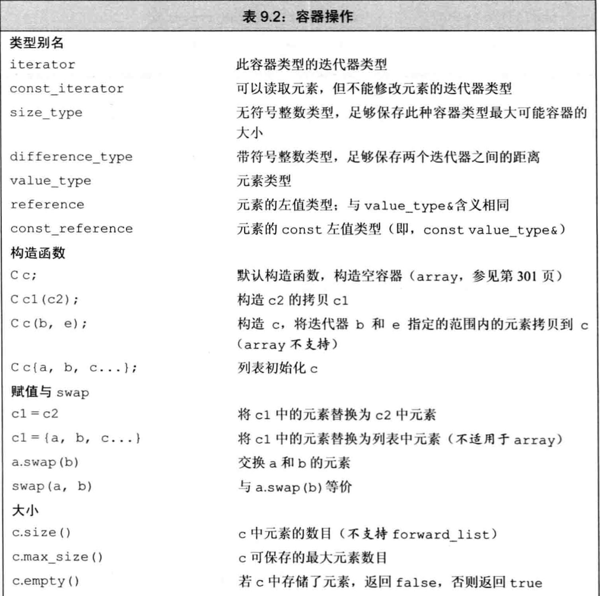

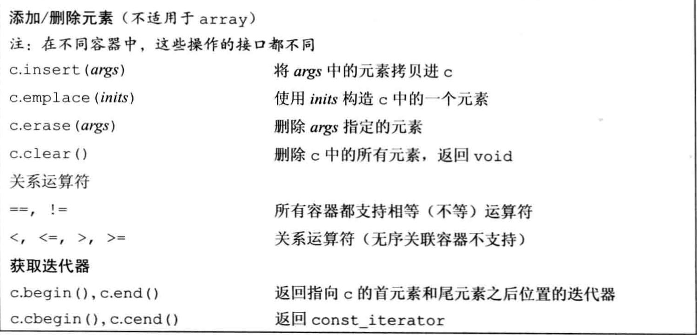

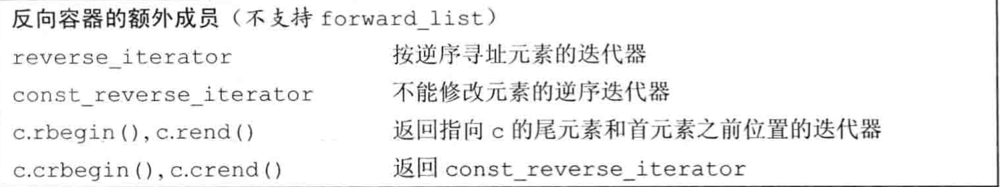

`迭代器`

迭代器返回由一对迭代器表示，两个迭代器分别指向容器中的元素或者是尾元素之后的位置，通常被称为`begin`和`end`。迭代器范围中的元素包含begin开始到end（不包括end）之间的所有元素。

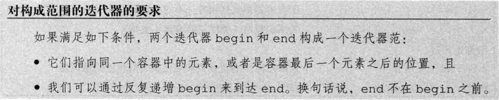

通过类型别名，我们可以再不了解容器中元素的情况下使用它。如果需要元素类型，可以使用容器的`value_type` 。如果需要元素类型的一个引用，可以使用`reference`或`const_reference` 。

~~~c++
list<string>::iterator iter; //通过list<string>定义一个迭代器类型
vector<int>::difference_type count;//count是通过vector<int>定义的一个difference_type类型
~~~

`begin`和`end`成员

两者分别指向容器中的第一个元素和尾元素之后的位置的迭代器，他们都有自己不同的版本，以begin为例子。

~~~c++
list<string> a = {"Milton","Shakespare","Austen"};
auto it1 = a.begin(); // list<string>::iterator
auto it2 = a.rbegin(); // list<string>::reverse_iterator
auto it3 = a.cbegin(); // list<string>::const_iterator
auto it4 = a.crbegin(); // list<string>::const_reverse_itreator
~~~

`容器的定义和初始化`

每个容器类型都定义了一个默认构造函数，除了array之外，其他容器的默认构造函数都会创建一个指定类型的空容器，且都可以接受指定容器大小和元素的初始值的参数。

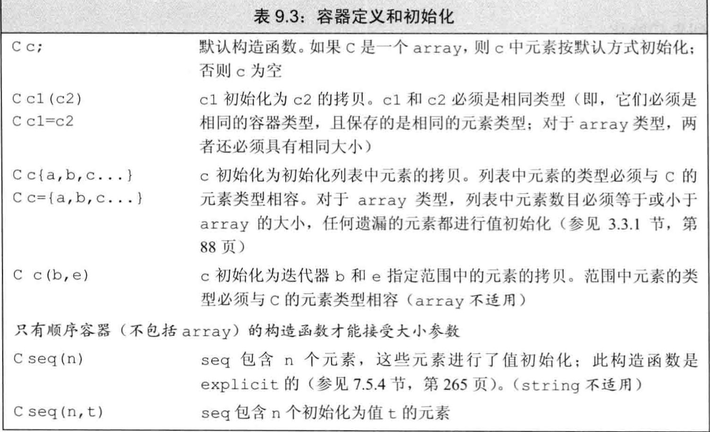

`与顺序容器大小相关的构造函数`

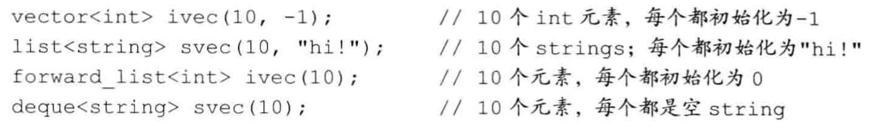

`标准库array具有固定大小`

~~~c++
array<int,42> //类型为：保存42个int的数组
~~~

虽然我们不能对内置数组类型进行拷贝或者对象赋值操作，但是array并无此限制。

~~~c++
int digs[10] = {0,1,2,3,4,5,6,7,8,9};
int cpy[10] = digs; //错误
array<int,10> digits = {0,1,2,3,4,5,6,7,8,9};
array<int,10> copy = digits; // 正确
~~~

`容器的赋值运算`

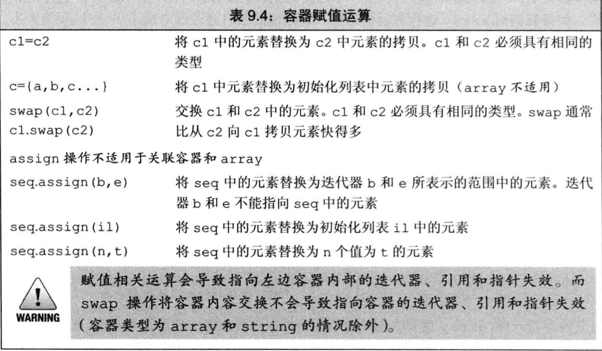

`使用assign（仅顺序容器）`

顺序容器（除了array）还定义了一个名为`assign`的成员，允许我们从一个不同但相容的类型赋值，或者从容器的一个子序列赋值。

assign操作用参数所指定的元素替换左边容器中的所有元素。

`使用swap`

调用swap之后，两个容器中的元素会被交换：

~~~c++
vector<string> svec1(10);
vector<string> svec2(24);
swap(svec1,svec2);
~~~

除了`array`外，swap不对任何元素进行拷贝，删除或插入操作，因此可以保证在常数时间内完成，元素不会移动意味着，除了string之外，指向容器的迭代器，引用和指针在Swap操作之后都不会失效。他们仍指向swap操作之前所指向的那些元素。

但是两个`array`的swap操作会真正的交换他们的元素。

`容器的比较操作`

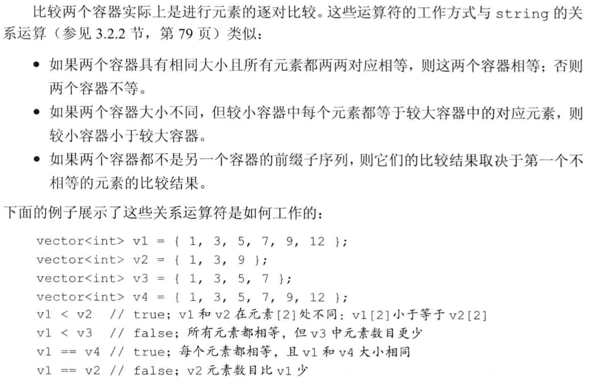

## 顺序容器操作

`向顺序容器添加元素`

除了`array`以外，所有的标准库容器都提供灵活的内存管理，在运行时可以动态添加或者删除元素来改变容器大小。

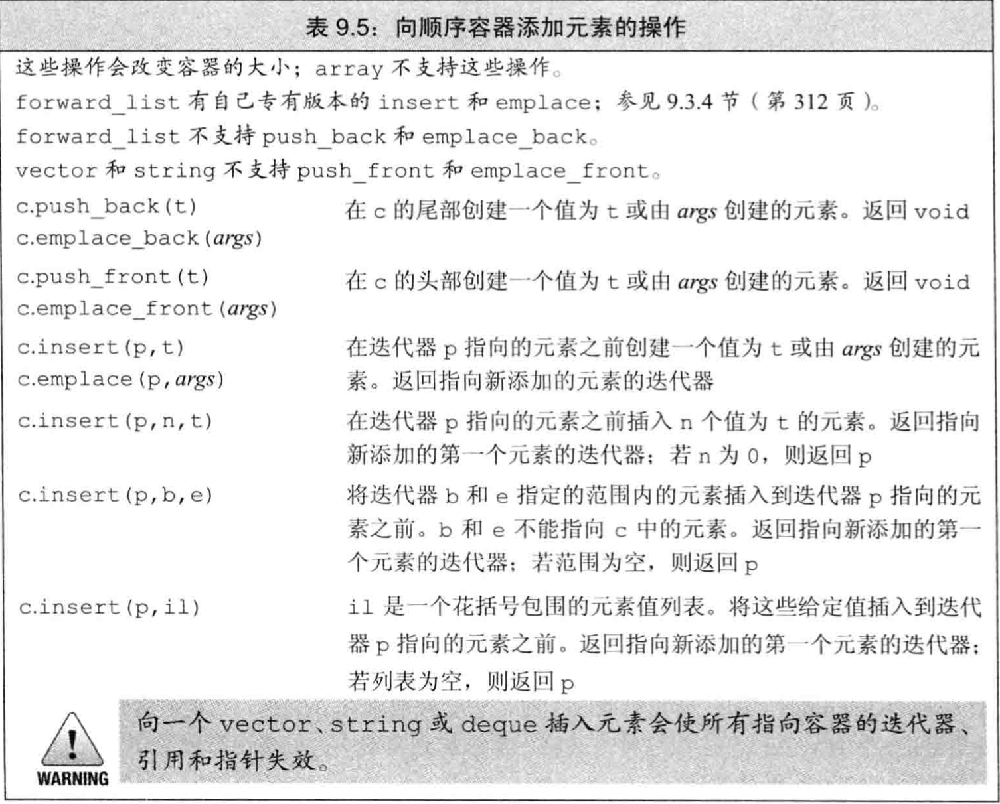

