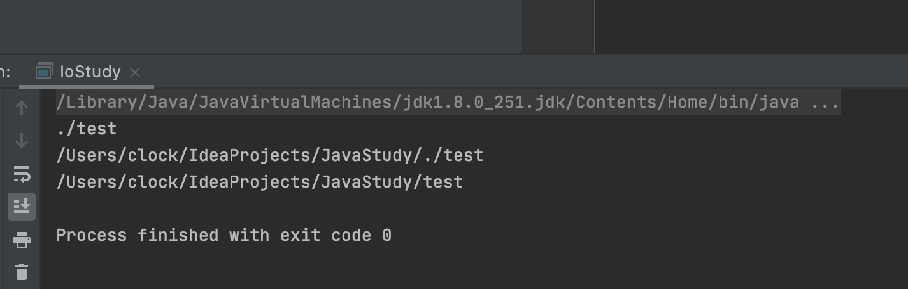

# IO

## InputStream/OutputSteam

IO流以`byte`为最小单位，也称为字节流。

###Reader/Writer

如果我们需要读写的是字符，并且字符不全是单字节表示的ASCII字符，那么，按照`char`来读写显然更方便，这种流称为*字符流*。

Java提供了`Reader`和`Writer`表示字符流，字符流传输的最小数据单位是`char`。

同时，`Reader`和`Writer`是一个可以自动进行编码和解码的流。

* `Reader`读入字节，但是都被转换成char型的，比如你使用`InputStream`,你得到的是`byte[]数组`

### 同步和异步

Java标准库的包`java.io`提供的是同步IO,`java.nio`提供的是异步的IO，面我们讨论的`InputStream`、`OutputStream`、`Reader`和`Writer`都是同步IO的抽象类，对应的具体实现类，以文件为例，有`FileInputStream`、`FileOutputStream`、`FileReader`和`FileWriter`。

## File对象

File对象方法常用：

* getPath()   // 相对路径
* getAbsolutePath()  // 绝对路径
* getCanonicalPath()  // 规范路径



java的绝对路径看起来还是有点奇怪的。

* isFile() \\判断是否是一个已存在的文件
* isDirectory()  \\ 判断是否是已存在的目录

## InputStream

`InputStream`就是Java标准库提供的最基本的输入流。它位于`java.io`这个包里。`java.io`包提供了所有同步IO的功能。

`InputStream`是一个抽象类，它是所有输入流的超类。

类内方法：

```java
public abstract int read() throws IOException;
```

这个方法会读取输入流的下一个字节，并返回字节表示的`int`值（0~255）。如果已读到末尾，返回`-1`表示不能继续读取了。

`FileInputStream`是`InputStream`的子类，从文件里面读取数据。

~~~java
public void readFile() throws IOException {
    // 创建一个FileInputStream对象:
    InputStream input = new FileInputStream("src/readme.txt");
    for (;;) {
        int n = input.read(); // 反复调用read()方法，直到返回-1
        if (n == -1) {
            break;
        }
        System.out.println(n); // 打印byte的值
    }
    input.close(); // 关闭流
}
~~~

但是上面写的其实不对的，因为我们没考虑到IO失败给程序带来的影响。

~~~java
 public void readFile() throws IOException{
        try(InputStream inputStream = new FileInputStream("./src/test")){
            int n;
            while ((n=inputStream.read())!=-1)
            {
                System.out.println(n);
            }
        }
    }
~~~

实际上，编译器并不会特别地为`InputStream`加上自动关闭。编译器只看`try(resource = ...)`中的对象是否实现了`java.lang.AutoCloseable`接口，如果实现了，就自动加上`finally`语句并调用`close()`方法。`InputStream`和`OutputStream`都实现了这个接口，因此，都可以用在`try(resource)`中。

**缓冲区**

* `int read(byte[] b)`：读取若干字节并填充到`byte[]`数组，返回读取的字节数
* `int read(byte[] b, int off, int len)`：指定`byte[]`数组的偏移量和最大填充数

但是此时的read函数返回值不是byte值了，而是读取的字节的个数，当返回值是-1的时候表示读完了。

> 注意，以上的那些read方法都是同步的，所以执行期间会产生阻塞，`InputStream`也有缓冲区。例如，从`FileInputStream`读取一个字节时，操作系统往往会一次性读取若干字节到缓冲区，并维护一个指针指向未读的缓冲区。然后，每次我们调用`int read()`读取下一个字节时，可以直接返回缓冲区的下一个字节，避免每次读一个字节都导致IO操作。当缓冲区全部读完后继续调用`read()`，则会触发操作系统的下一次读取并再次填满缓冲区。

### ByteArrayInputStream

方便快捷的读取字节数据。

~~~java
 public static void main(String[] args) throws IOException {
        byte[] data = {92,29,34,55,35};
        try(InputStream inputStream = new ByteArrayInputStream(data)){
            String s = readStr(inputStream);
            System.out.println(s);
        }
        }
        public static String readStr(InputStream s) throws IOException{
                int n;
                StringBuilder buf = new StringBuilder();
                while ((n=s.read())!=-1)
                {
                    buf.append(n);
                }
                String str = buf.toString();
                return str;
        }
~~~

可以看到，java确实很灵活。

## OutputStream

这个也是一个基本的抽象类，核心方法：

```java
public abstract void write(int b) throws IOException;
```

写一个字节到输出流，但是只写一个字节，即只写入`int`最低8位表示字节的部分（相当于`b & 0xff`）。

* close() : 关闭
* flush() : 将缓冲器真正的输入到目的地，通常情况：缓存区写满的时候会自动的调用这个函数。

文件写入：

~~~java
        OutputStream outputStream = new FileOutputStream("./src/test2");
        outputStream.write("good study".getBytes());
        outputStream.close();
~~~

### ByteArrayOutputStream

~~~java
byte[] data;
try(ByteArrayOutputStream byteArrayOutputStream = new ByteArrayOutputStream()){
            byteArrayOutputStream.write("hello".getBytes());
            data = byteArrayOutputStream.toByteArray();
        }
        System.out.println(data);
~~~


