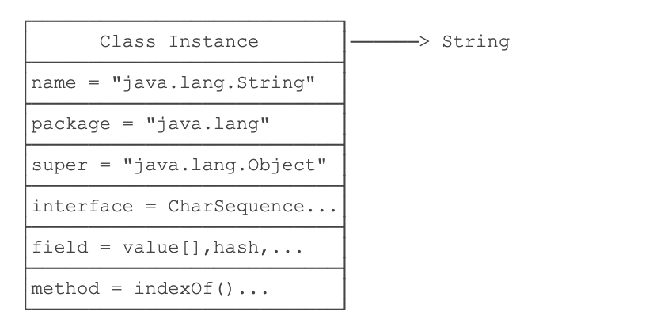

# JAVA-反射

java反射`Reflection`是指程序在运行期间可以拿到一个对象的所有信息。

Oracle官方对反射的解释：

> Reflection enables Java code to discover information about the fields, methods and constructors of loaded classes, and to use reflected fields, methods, and constructors to operate on their underlying counterparts, within security restrictions.
> The API accommodates applications that need access to either the public members of a target object (based on its runtime class) or the members declared by a given class. It also allows programs to suppress default reflective access control.

## Class类

除了`int`等基本类型外，JAVA的其他类型全部都是`class`（包括`interface`）.

* `String`
* `Object`
* `Runnable`
* `Exception`

等等。。。

> `class`（包括`interface`）的本质是数据类型（`Type`）。无继承关系的数据类型无法赋值：

`class`是在JVM里面动态加载的，JVM在第一次读取到`class`类的时候将其加载进内存。然而，每加载`一种class`，JVM就为其创建一个`Class`类型的实例，并且关联起来：

~~~java
public final class Class {
    private Class() {}
}
~~~

以`string`为例子：

当JVM记载`string`类的时候，先读取`String.class`文件，然后创建一个`String`实例与其相关联。

~~~java
Class cls = new Class(String); //这在编译器里面是不行的
~~~

这个`Class`由JVM内部创建，在jdk源码里面`Class`的构造方法是`private`，所以只有JVM可以创建`Class`实例，同时，一个`Class`包含了该`class`的所有完整信息：

由于JVM为每个加载的`class`创建了对应的`Class`实例，并在实例中保存了该`class`的所有信息，包括类名、包名、父类、实现的接口、所有方法、字段等，因此，如果获取了某个`Class`实例，我们就可以通过这个`Class`实例获取到该实例对应的`class`的所有信息。

反射：通过`Class`实例获取class信息的方法，这其实就是一个跟正常情况下有点类似于倒过来的过程，通过一个`Class`实例来得到`class`类的有关信息。

获取一个`class`的`Class`实例的三个方法：

1. ~~~java
   Class cls = String.class; //可以直接通过其静态成员获取
   ~~~

2. ~~~java
   String a = new String("asdasd");
           Class cls = a.getClass(); //可以通过实例的`getClass`方法
   ~~~

   

3. ~~~java
   public class ReflectionStudy {
       public static void main(String args[]) throws ClassNotFoundException {
           Class cls = Class.forName("java.lang.String");
       }
   } //这就涉及到可能找不到改类，所以要加一个异常，这里是通过一个class的完整类名获得的
   ~~~

注意`Class`类比较和`instanceof`的差别：

~~~java
				Integer n = new Integer(123);
        System.out.println(n);
        boolean b1 = n instanceof Integer; //ture,因为n是Integet类型
        System.out.println(b1);
        boolean b2 = n instanceof Number; //ture，因为n是Number类型的子类
        boolean b3 = n.getClass() == Integer.class; //ture , n.getclass() 返回 Integer.class
        boolean b4 = n.getClass() == Number.class; //Error , Integet.class != Number.class
~~~

可以得到一下结论：

* `instanceof`不但匹配指定类型，还匹配指定类型的子类。
* == 可以精确匹配数据类型

通过`reflection`获得类的基本信息：

~~~java
System.out.println("Class name: "  + cls.getName());
        System.out.println("Simple name: " + cls.getSimpleName());
        if (cls.getPackage() != null) {
            System.out.println("Package name: " + cls.getPackage().getName());
        }
        System.out.println("is interface: " + cls.isInterface());
        System.out.println("is enum: " + cls.isEnum());
        System.out.println("is array: " + cls.isArray());
        System.out.println("is primitive: " + cls.isPrimitive());
~~~

