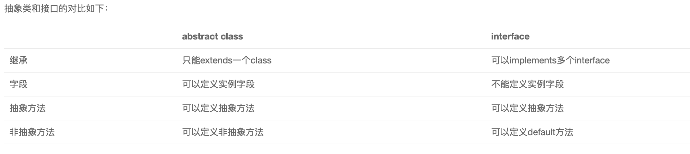

# 类基础

在继承关系中，子类如果定义了一个与父类方法签名完全相同的方法，被称为覆写（Override）。

Override和Overload不同的是，如果方法签名如果不同，就是Overload，Overload方法是一个新方法；如果方法签名相同，并且返回值也相同，就是`Override`。

加上`@Override`可以让编译器帮助检查是否进行了正确的覆写。希望进行覆写，但是不小心写错了方法签名，编译器会报错，但是是否加上@Override不是必须的。

~~~java
public class Main {
    public static void main(String[] args) {
        Person p = new Student();
        p.run(); // 应该打印Person.run还是Student.run?
    }
}

class Person {
    public void run() {
        System.out.println("Person.run");
    }
}

class Student extends Person {
    @Override
    public void run() {
        System.out.println("Student.run");
    }
}
~~~

上面的代码其实调用的是Student类的函数，那么就可以得出以下结论了：**Java的实例方法调用是基于运行时的实际类型的动态调用，而非变量的声明类型。**

## 多态

多态是指，针对某个类型的方法调用，其真正执行的方法取决于运行时期实际类型的方法？

~~~java
Person p = new Student();
p.run(); // 无法确定运行时究竟调用哪个run()方法
~~~

**多态的特性就是，运行期才能动态决定调用的子类方法。对某个类型调用某个方法，执行的实际方法可能是某个子类的覆写方法。**

如果一个类不希望任何其他类继承自它，那么可以把这个类本身标记为`final`。用`final`修饰的类不能被继承：

~~~java
final class Person {
    protected String name;
}

// compile error: 不允许继承自Person
Student extends Person {
}
~~~

## 抽象类

如果一个父类中的一个方法，其本身不需要实现，但是在子类继承的时候需要进行继承实现，那么就可以再父类里面把这个方法定义为抽象方法

把一个方法声明为`abstract`，表示它是一个抽象方法，本身没有实现任何方法语句。因为这个抽象方法本身是无法执行的，所以，`Person`类也无法被实例化。编译器会告诉我们，无法编译`Person`类，因为它包含抽象方法。

必须把`Person`类本身也声明为`abstract`，才能正确编译它：

~~~java
abstract class Person {
    public abstract void run();
}
~~~

**抽象类本身被设计成只能用于被继承，因此，抽象类可以强迫子类实现其定义的抽象方法，否则编译会报错。因此，抽象方法实际上相当于定义了“规范”。**

> 感觉抽象的本质还是在定义接口，从而保证所有子类都有相同的接口实现，这样，多态就能发挥出威力。

## 接口

所谓`interface`，就是比抽象类还要抽象的纯抽象接口，因为它连字段都不能有。因为接口定义的所有方法默认都是`public abstract`的，所以这两个修饰符不需要写出来（写不写效果都一样）。

~~~java
interface Person {
    void run();
    String getName();
}
~~~

接口实现：

~~~java
class Student implements Person {
    private String name;

    public Student(String name) {
        this.name = name;
    }

    @Override
    public void run() {
        System.out.println(this.name + " run");
    }

    @Override
    public String getName() {
        return this.name;
    }
}
~~~

同时一个类可以实现多个接口

~~~java
class Student implements Person, Hello { // 实现了两个interface
    ...
}
~~~

### 接口继承

~~~java
interface Hello {
    void hello();
}

interface Person extends Hello {
    void run();
    String getName();
}
~~~

### default方法

~~~java
public class Main {
    public static void main(String[] args) {
        Person p = new Student("Xiao Ming");
        p.run();
    }
}

interface Person {
    String getName();
    default void run() {
        System.out.println(getName() + " run");
    }
}

class Student implements Person {
    private String name;

    public Student(String name) {
        this.name = name;
    }

    public String getName() {
        return this.name;
    }
}
~~~

实现类可以不必覆写`default`方法。`default`方法的目的是，当我们需要给接口新增一个方法时，会涉及到修改全部子类。如果新增的是`default`方法，那么子类就不必全部修改，只需要在需要覆写的地方去覆写新增方法。

## 静态

实例字段在每个实例中都有自己的一个独立“空间”，但是静态字段只有一个共享“空间”，所有实例都会共享该字段。

因为静态方法属于`class`而不属于实例，因此，静态方法内部，无法访问`this`变量，也无法访问实例字段，它只能访问静态字段。

因为`interface`是一个纯抽象类，所以它不能定义实例字段。但是，`interface`是可以有静态字段的，并且静态字段必须为`final`类型：

~~~java
public interface Person {
    public static final int MALE = 1;
    public static final int FEMALE = 2;
}
~~~

## final

用`final`修饰`class`可以阻止被继承：

用`final`修饰`method`可以阻止被子类覆写：

用`final`修饰`field`可以阻止被重新赋值：

用`final`修饰局部变量可以阻止被重新赋值：

