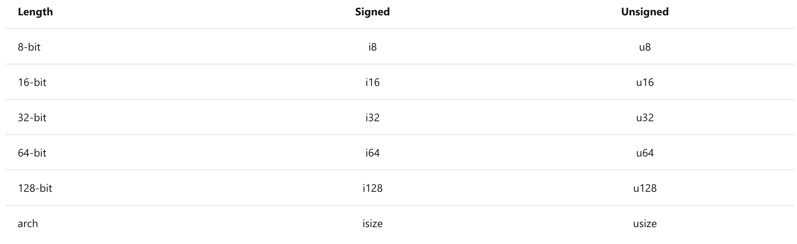

# rust基础

## Numbers

`isize` and `usize` types depend on the kind of computer your program is running on: 64 bits if you're on a 64-bit architecture and 32 bits if you're on a 32-bit architecture. They are default type assigned to integer whenever you don't specify one.

Rust's floating-point types are `f32` and `f64`, which are 32 bits and 64 bits in size ,respectively;

The default type is `f64` because on modern CPUs it's roughly the same speed as `f32` but is capable of more precision.

forexample：

~~~rust
use core::f64;
 struct Person {
     name: String,
     age: u8,
     likes_oranges: bool
 }
struct Point2D (u32, u32);
struct Unit;
fn main() {
    let a_numbers = 10;
    let a_boolean = true;
    println!("the number is {}.", a_numbers);
    println!("the boolean is {}", a_boolean);
    let  b_numbers = 10;
    println!("the number is {}", b_numbers);
    let _number: u64 = "42".parse().expect("Not a number");
    let text: f64 = 123.12;
    print!("the text is {}\n",text);
    println!("9 / 2 is {}", 9/2);
    let c = '2';
    let d = '3';
    let e = "str";
    println!("the string addr is {}", e);
    let mut hello = String::from("hello");
    hello.push('w');
    hello.push_str("orld");
    println!("{}", hello);
    let tuple = ("hello", 5, 'c');
    assert_eq!(tuple.0, "hello");
    assert_eq!(tuple.1, 5);
    assert_eq!(tuple.2, 'c');
}
~~~

## Learn about structs and enums

Rust have three types about Struct: `Classic C structs` , `Tuple structs` ,`Unit structs`:

* **Classic [C structs](https://en.wikipedia.org/wiki/Struct_(C_programming_language))** are the most commonly used. Each field defined within them has a name and a type. After they're defined, they can be accessed by using `example_struct.field` syntax.
* **Tuple structs** are similar to classic structs, but their fields have no names. For accessing individual variables, the same syntax is used as with regular tuples, namely, `foo.0`, `foo.1`, and so on, starting at zero.
* **Unit structs** are most commonly used as markers. They're useful when you need to implement a trait on something but don't need to store any data inside it.

from there , you can konw that Rust is like to C++ and Python.

`Instantiate structs`

~~~rust
fn main() {
    let person = Person {
        name: String::from("Adam"),
        likes_oranges: true,
        age: 25
    };
    let origin = Point2D(0, 0);
    let unit = Unit;
}
~~~

## Enums

Enums are types that can be any one of several variants.

~~~rust
enum WebEvent {
     PageLoad,
     PageUpload,
     KeyPress(char),
     Paste(String),
     Click {x: i64, y: i64}
 }
~~~

- `PageLoad` and `PageUnload` have no data associated with it at all.
- `Keypress` includes a single character in it.
- `Paste` includes a single string.
- `Click` includes an anonymous struct inside it.

## Create reusable functionality with functions

~~~rust
fn main() {
    println!("Hello world");
    another_function();
    is_divisible_by(32, 10);
}
fn another_function() {
    println!("Hello from other world");
}
fn is_divisible_by(dividend: u32, divisor: u32) -> bool {
    // If the divisor is zero, we want to return early with a `false` value
    if divisor == 0 {
    return false;
    }
    dividend % divisor == 0
}
~~~

## Array

~~~rust
fn main() {
    let weekdas = ["Monday", "Tuesday", "Wednesday", "Thursday", "Friday", "Saturday", "Sunday"];
    let byte_buffer = [0u8; 512]; // initialize an array of 512 elements where every element is a zero
}
~~~

## Vector

~~~rust
fn main() {
    let three_numbers = vec![1, 2, 3, 4, 5];
    println!("Initial vertor : {:?}", three_numbers);
    let ten_zero = vec![0; 10];
    println!("Initial ten_zero : {:?}", ten_zero);
      let mut v = Vec::new(); //Create a empty vector
    v.push(5); // pushes the number five into it...
    v.push(6);
    v.push(7);
    v.push(8);
    v.push(9);
    println!("{:?}", v);
    let mut d = vec![1,2];
    let two = d.pop();
    println!("{:?}", two);
}
~~~

The `{:?}` format parameter inside the `println!` Calls meaning that print all  information of vrctor.

## Hash maps

The type `HashMap<K, V>` stores a mapping of keys of type `K` to values pf type `V` . Where vectors store values by a integer index, hash maps store values by key.

~~~rust
use std::collections::HashMap;
fn main() {
    let mut book_reviews = HashMap::new();
    book_reviews.insert(
        "Adventures of Huckleberry Finn".to_string(),
        "My favorite book.".to_string(),
    );
    if book_reviews.contains_key("Adventures of Huckleberry Finn") {
        println!("We've got {} reviews, but Adventures of Huckleberry Finn are not one.", book_reviews.len());
    }
    println!("Reviews for Herman: {}", book_reviews["Adventures of Huckleberry Finn"]);
    book_reviews.remove("Adventures of Huckleberry Finn");
    assert_eq!(book_reviews.contains_key("Adventures of Huckleberry Finn"), true);
}
~~~

## Exercise - Indexing 

you must need to notice how to use the type of `Tuple`.

~~~rust
fn indexing_tuple() {
    let numbers = (1, 2, 3);
    // Replace below ??? with the tuple indexing syntax.
    let second = numbers.0;
    assert_eq!(
    2, second,
    "This is not the 2nd number in the tuple: {}",
    second
    )
}

fn indexing_array() {
    let characters = ['a', 'b', 'c', 'd', 'e'];
    // Replace below ??? with the array indexing syntax.
    let letter_d = characters[3];
    assert_eq!(
    'd', letter_d,
    "This is not the character for the letter d: {}",
    letter_d
    )
}

fn main() {
    indexing_tuple();
    indexing_array();
}
~~~

~~~rust
use std::collections::HashMap;

fn fruit_basket() -> HashMap<String, u32> {
    let mut basket = HashMap::new();  // TODO: declare your hash map here.
    // Two bananas are already given for you :)
    basket.insert(String::from("banana"), 2);
    // TODO: Put more fruits in your basket here.
    basket
}

fn main() {
    let basket = fruit_basket();
    assert!(
    basket.len() >= 3,
    "basket must have at least three types of fruits"
    );
    assert!(
        basket.values().sum::<u32>() >= 5,
        "basket must have at least five fruits"
    );
}
~~~

 ## Iterate through code with control flow

`Loop forever with loop`

~~~rust
    loop {
        println!("Hello world!");
    }
~~~

It's a infonote loop expression.

~~~rust
fn main() {
    let mut i = 0;
    loop {
        i = i + 1;
        println!("i is: {}", i);
        if i == 4 { break;}
    }
    let something = loop {
        i *= 2;
        if i > 100 { break i;} // there , i will be given to the something
    };
    assert_eq!(something, 128);
}
~~~

`Loop until a criteria is met with while loops`

> https://docs.microsoft.com/en-us/learn/modules/rust-understand-common-concepts/10-control-flow
>
> 

